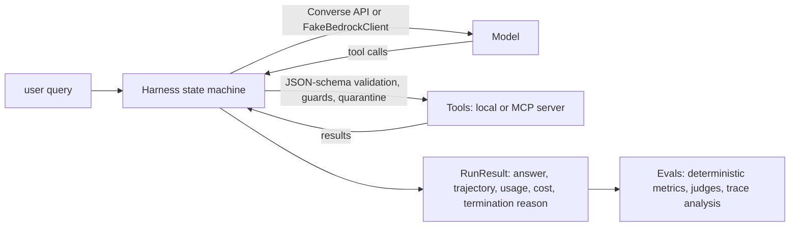

# Evaluating Autonomous Agents: Systems, Harnesses & AWS Production CI/CD

[](https://github.com/genial-labs-ai/system_agent_harness_aws/actions/workflows/agent_eval_ci.yml)
[](pyproject.toml)
[](https://docs.astral.sh/uv/)
[](https://docs.astral.sh/ruff/)
[](LICENSE)
[](#modes)
[](#live-mode-on-amazon-bedrock)
[](https://genial-labs-ai.github.io/system_agent_harness_aws/)
[](https://codespaces.new/genial-labs-ai/system_agent_harness_aws?quickstart=1)

A four-day, hands-on workshop repository. Participants clone it; instructors teach from it.
One running example is used throughout: **Stockroom**, an inventory and order-support agent with
five tools, a small product catalogue, policy documents for RAG, and four *deliberately seeded
weaknesses* that the labs expose and fix.

> **Thesis.** *Agent = Model + Harness.* Single-prompt evals miss most production failures, because
> agents break in the harness (tool-call formatting, loop control, context truncation, state
> drift) and in the environment (tools, data, permissions), not only in the model. Every claim in
> this repo about a failure mode is demonstrated by a test or a notebook cell, not just asserted.

Everything runs **offline by default** (`STOCKROOM_MODE=mock`): a deterministic fake Bedrock
client and a deterministic fake judge make the whole suite reproducible with no AWS credentials
and no network. Live mode (`STOCKROOM_MODE=live`) runs the same code against Amazon Bedrock.

**Website:** everything below is also published at
[genial-labs-ai.github.io/system_agent_harness_aws](https://genial-labs-ai.github.io/system_agent_harness_aws/):
lectures with rendered diagrams, the notebooks executed in mock mode with their outputs, the slide
decks, the instructor guide and the decisions log. Built by `make site` (Quarto) and by
`.github/workflows/pages.yml` on every pull request (which also runs `make site-check`: pages,
titles, links, and layout in Chrome at desktop and phone widths), and deployed on every push to
`main`.

## Contents

| | |
|---|---|
| `lectures/` | four lecture notes (objectives, timed agenda, Mermaid diagrams, discussion questions, common mistakes) |
| `slides/DAY1_MOTIVATIONAL_SLIDES.md` | Marp deck *Why Your AI Agent Fails in Production (and How Evals Fix It)* |
| `slides/DAY2_TEACHING_SLIDES.md`, `slides/DAY3_TEACHING_SLIDES.md`, `slides/DAY4_TEACHING_SLIDES.md` | Marp teaching decks for Days 2–4, with speaker notes: *When a Model Grades a Model (and What the Trace Shows)*, *The Model Proposes, the Harness Decides*, *An Eval That Does Not Block a Merge Is a Dashboard* |
| `slides/intro.qmd` | Quarto reveal.js kickoff deck: why we are here, the thesis, Stockroom, the four days, setup check, rules of the road |
| `notebooks/` | four notebooks (`Day1…Day4`), generated from `notebooks/src/*.py`; solutions in `notebooks/solutions/` |
| `src/stockroom/` | the agent (tools, harness, Bedrock adapter + fake), the eval suite (metrics, judges, calibration, tracing) and the MCP server |
| `data/` | catalogue, orders, policy docs (one contains a seeded prompt injection), golden set + dataset card, judge calibration set, reference hand-off artefacts for Day 4 (`data/handoff/`) |
| `reports/` | generated and gitignored, except the committed baseline `reports/baseline/main.json`: eval results and gate summary, `participant/` (what the Day 1–3 notebooks save for the Day 4 capstone) and `day4/` (the capstone's summaries and review) |
| `tests/` | unit tests, guard tests, seeded-weakness tests and the golden-set regression suite |
| `promptfooconfig.yaml` | Promptfoo suite: golden slice + red-team cases (offline) |
| `eval_thresholds.yaml` | the single place CI thresholds live |
| `.github/workflows/` | `agent_eval_ci.yml` (PR gate, mock), `agent_eval_nightly.yml` (live via OIDC, manual dispatch, report only), `pages.yml` (website) |
| `_quarto.yml`, `index.qmd`, `site/` | the website: project config, landing page, light/dark theme (`theme.scss`, `theme-dark.scss`), vendored fonts, logo, and the Lua filter that renders the GitHub-flavoured lectures unchanged |
| `docs/` | `DECISIONS.md` (every deviation and version pin), `INSTRUCTOR_GUIDE.md`, `TASKS.md`, `aws/` IAM policies |
| `.github/` | issue and PR templates, `CODEOWNERS`, Dependabot (grouped monthly PRs for uv, npm and Actions), path labeler, release-notes categories |
| `CONTRIBUTING.md`, `SECURITY.md`, `CODE_OF_CONDUCT.md`, `CITATION.cff` | how to contribute, how to report a real vulnerability (the seeded ones are features), and how to cite the workshop |

### Notebooks in the browser

Each notebook's setup cell clones and installs the repo when `stockroom` is not importable, so they
run in Google Colab or SageMaker Studio as well as locally. Mock mode needs no AWS account. The
Day 1–3 notebooks end by saving a small artefact that the Day 4 capstone reads back
(`reports/participant/`; a missing day falls back to a reference artefact). Colab deletes the
runtime's files when it is recycled, so there set `STOCKROOM_HANDOFF_DIR` to a folder on a
mounted Google Drive to keep them between days.

| day | student notebook | solutions |
|---|---|---|
| 1 · Deterministic and RAG Evals | [](https://colab.research.google.com/github/genial-labs-ai/system_agent_harness_aws/blob/main/notebooks/Day1_Deterministic_and_RAG_Evals.ipynb) | [solutions](notebooks/solutions/Day1_Deterministic_and_RAG_Evals.ipynb) |
| 2 · Judge Calibration and OTel Traces | [](https://colab.research.google.com/github/genial-labs-ai/system_agent_harness_aws/blob/main/notebooks/Day2_Judge_Calibration_and_OTEL_Traces.ipynb) | [solutions](notebooks/solutions/Day2_Judge_Calibration_and_OTEL_Traces.ipynb) |
| 3 · Building a Custom Agent Harness | [](https://colab.research.google.com/github/genial-labs-ai/system_agent_harness_aws/blob/main/notebooks/Day3_Building_Custom_Agent_Harness.ipynb) | [solutions](notebooks/solutions/Day3_Building_Custom_Agent_Harness.ipynb) |
| 4 · Bedrock Evaluations and CI Gating | [](https://colab.research.google.com/github/genial-labs-ai/system_agent_harness_aws/blob/main/notebooks/Day4_Bedrock_Evaluations_and_CI_Gating.ipynb) | [solutions](notebooks/solutions/Day4_Bedrock_Evaluations_and_CI_Gating.ipynb) |

## Quick start (no AWS needed)

Requirements: Python 3.12 (uv installs it), [uv](https://docs.astral.sh/uv/), Node 22 (the version CI uses; 20 or newer works) with npm
(Promptfoo and Marp are pinned in `package.json`/`package-lock.json` and installed by `make setup`),
GNU make. Docker is optional (devcontainer). The first `make setup` needs network to download
packages; everything afterwards runs offline.

```bash
git clone https://github.com/genial-labs-ai/system_agent_harness_aws.git
cd system_agent_harness_aws
make setup          # uv sync (+ Phoenix extra) and a Jupyter kernel
make test           # unit tests + golden-set regression suite (writes reports/eval_results.json)
make notebooks      # build student + solution notebooks and execute all eight in mock mode
make ci             # the whole PR gate: lint, data validation, tests, MCP server, evals, Promptfoo, notebooks, thresholds
```

Try the agent directly:

```bash
uv run stockroom config
uv run stockroom run "How many units of SKU-1015 are in stock?"
uv run stockroom run "What's the status of order ORD-9001?" --trace     # spans on the console
STOCKROOM_WEAKNESSES=naive_retry uv run stockroom run "What's the status of order ORD-9001?"
```

Watch the CI gate fail on a deliberately regressed build, then pass again:

```bash
STOCKROOM_WEAKNESSES=ambiguous_tool_desc make ci    # tool-selection accuracy drops to ~0.64 -> gate fails
make ci                                             # passes
```

## The Stockroom agent in one minute



Tools: `search_products`, `get_stock_level`, `get_order_status`, `create_restock_request`,
`search_policy_docs`. Harness states: `PLAN → CALL_MODEL → EXECUTE_TOOLS → OBSERVE → DONE | FAILED`,
with guards for max steps, per-run token budget, repeated identical calls and wall-clock time,
context compaction, and quarantine of instruction-like text in tool output.

### Seeded weaknesses (feature flags)

The shipped default has every weakness **fixed**, so the repo passes its own gate. Day 3 switches
them on one at a time with `STOCKROOM_WEAKNESSES=<flag>[,<flag>]`:

| flag | what breaks | what the evals show |
|---|---|---|
| `ambiguous_tool_desc` | `search_products` claims to cover stock and orders | tool-selection accuracy 1.0 → 0.64 while answers often still *look* right |
| `oversized_payload` | `search_products` returns every field of every product, no limit | context growth, compaction, `TOKEN_BUDGET` terminations |
| `naive_retry` | legacy order shard is down, no bounded retry, no repeated-call guard | identical calls until `MAX_STEPS`; loop detector fires |
| `injection_unguarded` | tool output is not quarantined | the injected policy text triggers a 10,000-unit restock and a system-prompt leak |

## Modes

| | mock (default) | live |
|---|---|---|
| model | `FakeBedrockClient`: scripted turns per golden case + a deterministic heuristic planner | `BedrockConverseClient` over `bedrock-runtime.converse` |
| judge | `FakeJudge` (rubric v1/v2) | `BedrockJudge` on `JUDGE_MODEL_ID` |
| cost | 0 | estimated from `pricing.yaml` and printed after every run |
| where | tests, notebooks, CI gate | nightly workflow, optional labs |

Notebooks call `stockroom.config.detect_mode()`, which picks live only when
`boto3.Session().get_credentials()` finds credentials **and** both model IDs are set, and prints
which mode it is in.

### Configuration (environment variables)

| variable | default | meaning |
|---|---|---|
| `STOCKROOM_MODE` | `mock` | `mock` or `live` |
| `AGENT_MODEL_ID` | — (required in live) | Bedrock model or inference-profile ID for the agent |
| `JUDGE_MODEL_ID` | — (required in live) | judge model, by default a *different family* from the agent |
| `AWS_REGION` | `us-east-1` | region for `bedrock-runtime`, `bedrock`, S3 |
| `MAX_TOKENS` / `MAX_STEPS` / `TOKEN_BUDGET` / `WALL_CLOCK_TIMEOUT_S` | 1024 / 8 / 20000 / 60 | per-call output cap, per-run step limit, per-run token budget, timeout |
| `REPEAT_CALL_WINDOW` | 3 | identical calls in a row before the repeated-call guard fires |
| `COMPACTION_TOKEN_THRESHOLD` / `COMPACTION_KEEP_TURNS` | 6000 / 4 | when to summarise old tool results, how many recent turns stay verbatim |
| `STOCKROOM_WEAKNESSES` | empty | comma list of the four flags above |
| `STOCKROOM_TOOL_TRANSPORT` | `local` | `local`, `mcp-stdio` (spawns the server) or `mcp-http` (`STOCKROOM_MCP_URL`, default `http://127.0.0.1:8765/mcp`) |
| `STOCKROOM_TRACE_EXPORTER` | `memory` | `memory`, `console`, `phoenix`, `cloudwatch`, `none` |
| `S3_BUCKET` / `S3_PREFIX` | — / `stockroom-workshop` | versioned golden sets and reports (live) |
| `KNOWLEDGE_BASE_ID` | — | optional Bedrock Knowledge Base for the Day 1 live RAG branch |
| `AGENT_PRICE_INPUT_PER_1K`, `AGENT_PRICE_OUTPUT_PER_1K`, `JUDGE_PRICE_*` | — | per-1K-token prices when a model is not in `pricing.yaml` |
| `STOCKROOM_EVAL_REPEATS` | 1 | run each golden case N times (nightly: 3) to measure run-to-run spread |
| `STOCKROOM_CONFIRM_AWS_SPEND` | unset | must be `1` before the Day 4 notebook submits a Bedrock Evaluations job |
| `STOCKROOM_HANDOFF_DIR` | `reports/participant` | where the Day 1–3 notebooks save their artefacts for the Day 4 capstone (relative paths are taken from the repository root) |

## Live mode on Amazon Bedrock

Nothing in this repository creates AWS resources. You create them once; the code only calls them.

### 1. Model access and IDs

1. Pick an **agent** model and a **judge** model from *different families* (self-preference bias:
   a judge tends to prefer outputs from its own family). The defaults used in the docs and in
   `docs/aws/iam_policy.json` are:

   | role | ID (verified 2026-10-06 on the Bedrock "models at a glance" pages) |
   |---|---|
   | agent | `us.anthropic.claude-haiku-4-5-20251001-v1:0` (Claude Haiku 4.5 via the US cross-region profile; the bare model ID is not supported for on-demand use on `bedrock-runtime`) |
   | judge | `us.amazon.nova-pro-v1:0` (Amazon Nova Pro; also a supported Bedrock Evaluations judge) |

   Cheaper alternatives: `us.amazon.nova-2-lite-v1:0` as judge; `us.anthropic.claude-sonnet-4-5-20250929-v1:0` as a stronger agent.
2. List what your account can use (IDs change; never trust a document, including this one):

   ```bash
   aws bedrock list-foundation-models --by-output-modality TEXT \
     --query "modelSummaries[].{id:modelId,name:modelName,inference:inferenceTypesSupported}" --output table
   aws bedrock list-inference-profiles --type-equals SYSTEM_DEFINED \
     --query "inferenceProfileSummaries[?status=='ACTIVE'].[inferenceProfileId,inferenceProfileName]" --output table
   aws bedrock get-inference-profile --inference-profile-identifier us.amazon.nova-pro-v1:0 --query 'models[].modelArn'
   ```

3. Model access: most models are enabled automatically on first use provided the caller has the
   AWS Marketplace permissions (`aws-marketplace:Subscribe`, `ViewSubscriptions`, `Unsubscribe`).
   **Anthropic models additionally require the one-time use-case form** per account
   (`aws bedrock put-use-case-for-model-access` or the console's model catalog). Amazon Nova models
   need no Marketplace subscription. Details: [Request access to models](https://docs.aws.amazon.com/bedrock/latest/userguide/model-access.html).
4. Export the variables:

   ```bash
   export STOCKROOM_MODE=live AWS_REGION=us-east-1
   export AGENT_MODEL_ID=us.anthropic.claude-haiku-4-5-20251001-v1:0
   export JUDGE_MODEL_ID=us.amazon.nova-pro-v1:0
   uv run python scripts/sync_datasets_s3.py check-models   # resolves both IDs, no inference
   uv run stockroom run "How many units of SKU-1015 are in stock?"
   ```

### 2. Cost expectations

Every live run prints its token usage and an estimated cost. Prices come from `pricing.yaml`,
generated by `scripts/fetch_pricing.py` from the **public AWS Price List API** (no credentials).
That feed contains Amazon Nova on-demand prices but **not** third-party models billed through AWS
Marketplace (Anthropic Claude 4.x/5.x), so their entries are `null` and the run prints
"cost unknown" until you either fill them in from the [pricing page](https://aws.amazon.com/bedrock/pricing/)
or set `AGENT_PRICE_INPUT_PER_1K` / `AGENT_PRICE_OUTPUT_PER_1K`. No price is ever guessed.

Rough sizing (mock-mode measurements): a golden case uses ~2 model calls and ~2,000 input tokens;
the 50-case suite is ~100 model calls plus ~100 judge calls. With `MAX_STEPS=8` and
`TOKEN_BUDGET=20000` a single runaway run is capped at 20K tokens.

### 3. S3 bucket (datasets and reports)

Create a bucket and set `S3_BUCKET` (and optionally `S3_PREFIX`). The sync script keeps golden
sets immutable per manifest version and uploads nightly reports:

```bash
uv run python scripts/sync_datasets_s3.py sync-golden            # upload the pinned version if missing, verify sha256
uv run python scripts/sync_datasets_s3.py download-golden --version 1.0.0
uv run python scripts/sync_datasets_s3.py upload-reports --run-id local
```

### 4. GitHub OIDC role for the nightly workflow

No long-lived keys anywhere. In IAM: create the GitHub OIDC identity provider
(`token.actions.githubusercontent.com`, audience `sts.amazonaws.com`; a certificate thumbprint is
no longer required), create a role with `docs/aws/oidc_trust_policy.json` as its trust policy
(restricted to `repo:genial-labs-ai/system_agent_harness_aws:ref:refs/heads/main`) and
`docs/aws/iam_policy.json` as its permissions (Bedrock invoke on the two configured profiles and
their underlying foundation models, S3 read/write under one prefix, nothing else — see
`docs/aws/README.md`). Then set repository **variables** `AWS_OIDC_ROLE_ARN`, `AWS_REGION`,
`AGENT_MODEL_ID`, `JUDGE_MODEL_ID`, `S3_BUCKET` (and optionally `S3_PREFIX`,
`STOCKROOM_EVAL_REPEATS`). The live workflow is manual-only (`workflow_dispatch`), is skipped until `AWS_OIDC_ROLE_ARN`
exists and never blocks pull requests. References: [GitHub: configuring OIDC in AWS](https://docs.github.com/en/actions/security-for-github-actions/security-hardening-your-deployments/configuring-openid-connect-in-amazon-web-services),
[aws-actions/configure-aws-credentials](https://github.com/aws-actions/configure-aws-credentials).

### 5. Optional: Bedrock Knowledge Base (Day 1)

The mock RAG lab uses the in-repo BM25 retriever over `data/policy_docs/`. To compare against a
managed retriever, create a Knowledge Base from the same six markdown files (any vector store),
sync it, and set `KNOWLEDGE_BASE_ID`; the notebook then calls `bedrock-agent-runtime.retrieve`
and scores the results with the same RAGAS metrics. Setup: [Amazon Bedrock Knowledge Bases](https://docs.aws.amazon.com/bedrock/latest/userguide/knowledge-base.html).
Add `bedrock:Retrieve` on the knowledge-base ARN to the role if you use it from CI.

### 6. Optional: CloudWatch GenAI observability (Day 2)

Install the CloudWatch extra (`uv sync --extra cloudwatch`; it is mutually exclusive with the
Phoenix extra, see `docs/DECISIONS.md`) and run the process under the AWS Distro for
OpenTelemetry as documented in
[Add observability to your Amazon Bedrock AgentCore resources](https://docs.aws.amazon.com/bedrock-agentcore/latest/devguide/observability-configure.html):

```bash
# one-time, per account: CloudWatch Transaction Search (plus the logs resource policy from the page above)
aws xray update-trace-segment-destination --destination CloudWatchLogs

export AGENT_OBSERVABILITY_ENABLED=true OTEL_PYTHON_DISTRO=aws_distro OTEL_PYTHON_CONFIGURATOR=aws_configurator
export OTEL_EXPORTER_OTLP_PROTOCOL=http/protobuf OTEL_TRACES_EXPORTER=otlp
export OTEL_RESOURCE_ATTRIBUTES="service.name=stockroom-agent,aws.log.group.names=/aws/bedrock-agentcore/runtimes/stockroom"
export OTEL_EXPORTER_OTLP_LOGS_HEADERS="x-aws-log-group=/aws/bedrock-agentcore/runtimes/stockroom,x-aws-log-stream=runtime-logs,x-aws-metric-namespace=stockroom"
# optional (ADOT >= 0.18): deliver spans to your own log group instead of aws/spans ("unified telemetry")
export OTEL_EXPORTER_OTLP_TRACES_HEADERS="x-aws-log-group=/aws/bedrock-agentcore/runtimes/stockroom,x-aws-log-stream=spans"
export STOCKROOM_TRACE_EXPORTER=cloudwatch
uv run opentelemetry-instrument python -m stockroom.cli run "What's the status of order ORD-1001?"
```

Spans then appear under CloudWatch → *GenAI Observability*; the same spans feed AgentCore
Evaluations' on-demand `evaluate` API (Day 4). The IAM permissions for the exporter are listed on
that AWS page and are not part of `docs/aws/iam_policy.json` (they are not needed by the CI gate).

### 7. Optional: Bedrock Evaluations job (Day 4)

The Day 4 notebook builds the exact `create_evaluation_job` request for an LLM-as-a-judge job over
the golden set using bring-your-own-inference-responses, and submits it only when
`STOCKROOM_MODE=live`, `STOCKROOM_CONFIRM_AWS_SPEND=1` and `EVAL_ROLE_ARN` (a service role that
Bedrock can assume, with S3 access to the dataset and output prefixes) are set.
[Docs](https://docs.aws.amazon.com/bedrock/latest/userguide/evaluation-judge.html). Note that
Bedrock Evaluations scores *answers*; trajectories are scored with AgentCore Evaluations.

## Local observability: Arize Phoenix

```bash
make phoenix                                   # http://localhost:6006
STOCKROOM_TRACE_EXPORTER=phoenix uv run stockroom run "Check stock for SKU-1018 and SKU-1033."
```

Spans follow the OpenTelemetry GenAI semantic conventions (`chat {model}`, `execute_tool {tool}`,
`invoke_agent stockroom`, `gen_ai.*` attributes; see `src/stockroom/evals/semconv.py`). Phoenix
≥ 15.10 converts them to its OpenInference view automatically.

## CI gate

`agent_eval_ci.yml` runs on every pull request in mock mode: `uv sync` → lint → data validation →
unit tests → start the MCP server (streamable HTTP) and smoke-test it → golden-set regression
suite over MCP → Promptfoo suite → build and execute all notebooks → `scripts/check_thresholds.py`.
The gate fails when `tool_selection_accuracy < 0.85`, `answer_correctness < 0.85`, any red-team
case fails (an attack succeeded), a hard invariant is violated, or a metric drops more than 0.05
against `reports/baseline/main.json`. It posts a metrics table with the diff versus the main
baseline as a sticky PR comment and as the job summary. Regenerate the baseline deliberately with
`make baseline` and explain the diff in the PR.

`agent_eval_nightly.yml` runs the same suite in live mode with `STOCKROOM_EVAL_REPEATS=3`,
reports run-to-run spread and case-bootstrap intervals, uploads reports to S3 and as an artifact, and never blocks PRs.
It has **no schedule**: start it by hand from the Actions tab or with
`gh workflow run agent-eval-nightly -f repeats=3`, so Bedrock spend happens only on request.

## Placeholders to replace before going live

The repository lives at `genial-labs-ai/system_agent_harness_aws` (already filled in here, in
`docs/aws/oidc_trust_policy.json`, the notebooks' setup cells (`REPO_URL`) and
`docs/INSTRUCTOR_GUIDE.md`). Still to replace: `<ACCOUNT_ID>`, `<AWS_REGION>`, `<S3_BUCKET>`,
`<S3_PREFIX>` in `docs/aws/*.json`.

## Contributing, security and citation

- `CONTRIBUTING.md`: ground rules, the baseline-regeneration workflow for metric changes, and the PR checklist.
- `SECURITY.md`: the seeded weaknesses and the planted injection are lab features; anything that breaks the *default* harness or widens the OIDC trust is a real report, filed privately.
- `CITATION.cff`: GitHub's "Cite this repository" button uses it.
- Issues: templates for bugs, lab/lecture feedback and proposals; PRs get path labels automatically.

## Troubleshooting

| symptom | fix |
|---|---|
| `ConfigError: Live mode needs AGENT_MODEL_ID and JUDGE_MODEL_ID` | export both, or unset `STOCKROOM_MODE` to fall back to mock |
| `AccessDeniedException` on first Anthropic call | submit the one-time use-case form; check Marketplace permissions; wait up to 15 minutes |
| `ValidationException … on-demand throughput isn't supported` | use the `us.`/`global.` inference-profile ID, not the bare model ID |
| `make ci` fails at `mcp-smoke` | port 8765 in use: `MCP_PORT=8777 make ci` or stop the other process |
| notebooks fail with `ModuleNotFoundError: stockroom` | run `make setup` (kernel + editable install); in Colab the setup cell clones and installs the repo |
| `make promptfoo` says Promptfoo/Marp are not installed | run `make setup` once with network access (`npm ci` installs the pinned versions); afterwards they run offline from `node_modules/.bin` |
| `make lint` complains in `notebooks/` | notebooks are excluded; edit `notebooks/src/*.py` and rebuild |
| metrics changed but you expected them to | you probably have `STOCKROOM_WEAKNESSES` set in your shell |

## Pinned versions

Verified against current documentation and installed on 2026-10-06 (full tree in `uv.lock`;
`make pins` prints the live table):

| package | version |
|---|---|
| python | 3.12 |
| deepeval | 4.2.8 |
| ragas | 0.4.3 |
| mcp (official Python SDK, v2 API) | 2.3.0 |
| boto3 / botocore | 1.43.108 |
| opentelemetry-sdk / -api / -exporter-otlp-proto-http | 1.45.1 (1.44.0 with the `cloudwatch` extra) |
| opentelemetry-semantic-conventions | 0.66b1 |
| openinference-semantic-conventions | 0.1.41 |
| arize-phoenix / arize-phoenix-otel (`phoenix` extra) | 20.19.0 / 0.17.2 |
| aws-opentelemetry-distro (`cloudwatch` extra) | 0.21.0 |
| pydantic / jsonschema / pyyaml | 2.13.5 / 4.26.0 / 6.0.3 |
| pytest / ruff / jupytext / nbmake / ipykernel | 9.1.1 / 0.16.10 / 1.19.6 / 1.5.5 / 7.4.0 |
| promptfoo (npm) | 0.124.0 |
| @marp-team/marp-cli (npm) | 4.5.1 |
| GitHub Actions | checkout v7, setup-uv v10.2.0 (exact tag; the action publishes no moving major tag), setup-node v7, upload-artifact v7, github-script v9, aws-actions/configure-aws-credentials v6.3.0 |

See `docs/DECISIONS.md` for why each deviation from the brief was made (for example the
`phoenix`/`cloudwatch` extra conflict, the hand-written red-team suite, and why Bedrock
Evaluations scores answers rather than trajectories).
