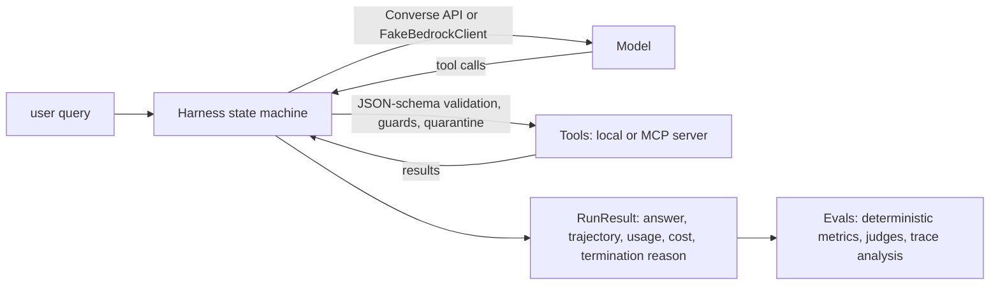

::: {.hero}
<div class="eyebrow">Genial Labs · four-day workshop</div>
<p class="lead">One running example, <strong>Stockroom</strong>, an inventory and order-support agent with five
tools, a policy corpus and four deliberately seeded weaknesses. Every claim about a failure mode is
demonstrated by a test or a notebook cell, not just asserted.</p>
<div class="thesis">Agent = Model + Harness</div>
:::

::: {.badges}
[](https://github.com/genial-labs-ai/system_agent_harness_aws/actions/workflows/agent_eval_ci.yml)
[](https://github.com/genial-labs-ai/system_agent_harness_aws/blob/main/pyproject.toml)
[](https://github.com/genial-labs-ai/system_agent_harness_aws/blob/main/LICENSE)
[](#mock-and-live)
[](#mock-and-live)
[](https://codespaces.new/genial-labs-ai/system_agent_harness_aws?quickstart=1)
:::

```{=html}
<div class="cards">
<a class="card-link" href="lectures/day1_llm_eval_foundations.html"><div class="card-title">Lectures</div><div class="card-text">Four lecture notes with objectives, a timed agenda, diagrams, discussion questions and the mistakes people make.</div></a>
<a class="card-link" href="notebooks/Day1_Deterministic_and_RAG_Evals.html"><div class="card-title">Notebooks</div><div class="card-text">Four labs, executed here in mock mode so you can read every output. Exercise cells have matching solutions.</div></a>
<a class="card-link" href="slides/intro.html"><div class="card-title">Kickoff slides</div><div class="card-text">The deck instructors open with: why we are here, the thesis, the running example and the rules of the road.</div></a>
<a class="card-link" href="docs/INSTRUCTOR_GUIDE.html"><div class="card-title">Instructor guide</div><div class="card-text">Timings, setup, what participants actually get stuck on, and how to regenerate the generated artefacts.</div></a>
</div>
```

## Why single-prompt evals are not enough

Agents break in the **harness** (tool-call formatting, loop control, context truncation, state drift)
and in the **environment** (tools, data, permissions), not only in the model. So the eval suite
exercises tool selection, tool arguments, trajectories, guards, context compaction and injection
handling, and only then the final answer.



## The four days

| day | lecture | lab |
|---|---|---|
| 1 | [LLM evaluation foundations](lectures/day1_llm_eval_foundations.html): golden sets, deterministic metrics, DeepEval, RAGAS over the policy corpus | [Deterministic and RAG evals](notebooks/Day1_Deterministic_and_RAG_Evals.html) |
| 2 | [LLM-as-a-judge, calibration and OpenTelemetry](lectures/day2_llm_as_a_judge_and_otel.html): error analysis first, judges calibrated against human labels, one span tree per run | [Judge calibration and OTel traces](notebooks/Day2_Judge_Calibration_and_OTEL_Traces.html) |
| 3 | [A custom agent harness and MCP mocking](lectures/day3_agent_harness_and_mcp_mocking.html): the state machine, five runtime failure classes, MCP as the tool boundary, AgentCore | [Building a custom agent harness](notebooks/Day3_Building_Custom_Agent_Harness.html) |
| 4 | [Production CI/CD on AWS](lectures/day4_aws_ci_cd_redteaming.html): thresholds from baseline variance, flaky evals, red-teaming, Bedrock and AgentCore Evaluations | [Bedrock Evaluations and CI gating](notebooks/Day4_Bedrock_Evaluations_and_CI_Gating.html) |

## Seeded weaknesses

The shipped default has every weakness **fixed**, so the repository passes its own gate. Day 3
switches them on one at a time with `STOCKROOM_WEAKNESSES=<flag>[,<flag>]`.

::: {.weaknesses}
| flag | what breaks | what the evals show |
|---|---|---|
| `ambiguous_tool_desc` | `search_products` claims to cover stock and orders | tool-selection accuracy 1.0 → 0.64 while answers often still *look* right |
| `oversized_payload` | `search_products` returns every field of every product, no limit | context growth, compaction, `TOKEN_BUDGET` terminations |
| `naive_retry` | legacy order shard is down, no bounded retry, no repeated-call guard | identical calls until `MAX_STEPS`; loop detector fires |
| `injection_unguarded` | tool output is not quarantined | the injected policy text triggers a 10,000-unit restock and a system-prompt leak |
:::

## Quick start

No AWS account is needed. The first `make setup` downloads packages; everything after that runs offline.

```bash
git clone https://github.com/genial-labs-ai/system_agent_harness_aws.git
cd system_agent_harness_aws
make setup          # uv sync (+ Phoenix extra) and a Jupyter kernel
make test           # unit tests + golden-set regression suite
make notebooks      # build student + solution notebooks and execute all eight in mock mode
make ci             # the whole PR gate
STOCKROOM_WEAKNESSES=ambiguous_tool_desc make ci    # watch the gate fail on purpose
```

## Mock and live

| | mock (default) | live |
|---|---|---|
| model | `FakeBedrockClient`, scripted per golden case | Amazon Bedrock Converse API, `AGENT_MODEL_ID` from the environment |
| judge | `FakeJudge`, deterministic | Bedrock judge, `JUDGE_MODEL_ID` from the environment |
| credentials | none | GitHub OIDC → IAM role in CI, your AWS profile locally |
| spend | zero | bounded by `MAX_STEPS` and `TOKEN_BUDGET`; estimated cost printed per run |

Live mode is opt-in (`STOCKROOM_MODE=live`) and the live workflow is dispatched by hand, never on a
schedule, so Bedrock spend happens only when an instructor asks for it. Setup details, model
access and the OIDC role are in the
[README](https://github.com/genial-labs-ai/system_agent_harness_aws#live-mode-on-amazon-bedrock).
