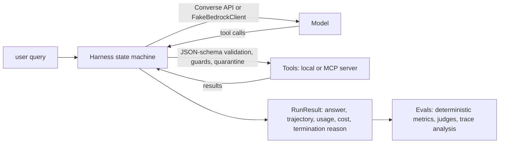

::: {.hero}
[Genial Labs · a four-day workshop]{.eyebrow}

# Evaluating Autonomous Agents {.unnumbered .unlisted}

[Systems, Harnesses & AWS Production CI/CD]{.hero-subtitle}

::: {.hero-lead}
An agent that works in a demo is not evidence that it works. Agents break in the harness and in
the environment, and the final answer often still looks fine. This workshop builds the evals that
catch those failures, then wires them into a CI gate on AWS. One running example, **Stockroom**,
an inventory and order-support agent; every claim about a failure mode is demonstrated by a test
or a notebook cell you can run offline.
:::

::: {.hero-actions}
[Start with Day 1](lectures/day1_llm_eval_foundations.md){.btn-primary-action} [Kickoff slides](slides/intro.qmd) [Open the notebooks](notebooks/Day1_Deterministic_and_RAG_Evals.ipynb) [Instructor guide](docs/INSTRUCTOR_GUIDE.md)
:::

::: {.facts}
[**4** days]{.fact}
[**4** lectures, **8** notebooks]{.fact}
[**5** tools, **4** seeded weaknesses]{.fact}
[**50** golden cases]{.fact}
[**0** AWS credentials needed]{.fact}
:::
:::

::: {.thesis}
[Agent = Model + *Harness*]{.thesis-line}
[The model proposes; the harness decides what is allowed to happen. Most production failures live in the harness and the environment, so that is what the eval suite exercises first.]{.thesis-gloss}
:::

## Why single-prompt evals are not enough

::: {.section-lede}
A single-prompt eval scores the final answer and nothing else. The Stockroom suite scores tool
selection, tool arguments, trajectories, guards, context compaction and injection handling, and
only then the answer.
:::

::: {.surfaces}
::: {.surface-model}
[Where failures live]{.eyebrow}
**The model**

Wrong tool, wrong arguments, an answer that is not grounded in what the tools returned. The part
single-prompt evals already see.
:::
::: {.surface-harness}
[Where most of them live]{.eyebrow}
**The harness**

Tool-call formatting, loop control, context truncation, state drift, unquarantined tool output.
The agent loop you wrote, or the one your framework wrote for you.
:::
::: {.surface-environment}
[Where the rest live]{.eyebrow}
**The environment**

Tools, data and permissions: a misleading tool description, an oversized payload, a shard that is
down, a policy document with an instruction planted in it.
:::
:::



The harness is `src/stockroom/agent/harness.py`; its states are `PLAN → CALL_MODEL →
EXECUTE_TOOLS → OBSERVE → DONE | FAILED`, with guards for max steps, a per-run token budget,
repeated identical calls and wall-clock time, context compaction, and quarantine of
instruction-like text in tool output.

## The four days

::: {.section-lede}
Each day answers one question, with a 90-minute lecture in the morning and a four-hour lab in
two parts. Every lab runs offline in mock mode; live AWS is opt-in.
:::

::: {.day-grid}
::: {.day-card}
[Day 1]{.eyebrow}

[LLM Evaluation Foundations](lectures/day1_llm_eval_foundations.md){.day-card-title}

[What does "the agent works" mean, and how would you know?]{.day-card-question}

::: {.day-card-links}
[Lecture](lectures/day1_llm_eval_foundations.md){.btn-quiet} [Slides](slides/DAY1_MOTIVATIONAL_SLIDES.html){.btn-quiet} [Lab](notebooks/Day1_Deterministic_and_RAG_Evals.ipynb){.btn-lab}
:::
:::
::: {.day-card}
[Day 2]{.eyebrow}

[LLM-as-a-Judge, Calibration, and OTel](lectures/day2_llm_as_a_judge_and_otel.md){.day-card-title}

[When can a model grade a model, and what did the agent actually do?]{.day-card-question}

::: {.day-card-links}
[Lecture](lectures/day2_llm_as_a_judge_and_otel.md){.btn-quiet} [Slides](slides/DAY2_TEACHING_SLIDES.html){.btn-quiet} [Lab](notebooks/Day2_Judge_Calibration_and_OTEL_Traces.ipynb){.btn-lab}
:::
:::
::: {.day-card}
[Day 3]{.eyebrow}

[Agent Harness and MCP Mocking](lectures/day3_agent_harness_and_mcp_mocking.md){.day-card-title}

[Which failures live in the harness, and how do you build one that refuses them?]{.day-card-question}

::: {.day-card-links}
[Lecture](lectures/day3_agent_harness_and_mcp_mocking.md){.btn-quiet} [Slides](slides/DAY3_TEACHING_SLIDES.html){.btn-quiet} [Lab](notebooks/Day3_Building_Custom_Agent_Harness.ipynb){.btn-lab}
:::
:::
::: {.day-card}
[Day 4]{.eyebrow}

[AWS CI/CD and Red Teaming](lectures/day4_aws_ci_cd_redteaming.md){.day-card-title}

[How does an eval become a gate that blocks a merge?]{.day-card-question}

::: {.day-card-links}
[Lecture](lectures/day4_aws_ci_cd_redteaming.md){.btn-quiet} [Slides](slides/DAY4_TEACHING_SLIDES.html){.btn-quiet} [Lab](notebooks/Day4_Bedrock_Evaluations_and_CI_Gating.ipynb){.btn-lab}
:::
:::
:::

Instructors open with the [kickoff slides](slides/intro.qmd); the
[Day 1 deck](slides/DAY1_MOTIVATIONAL_SLIDES.html) makes the case for the week, and Days
[2](slides/DAY2_TEACHING_SLIDES.html), [3](slides/DAY3_TEACHING_SLIDES.html) and
[4](slides/DAY4_TEACHING_SLIDES.html) each have a teaching deck with speaker notes. Each notebook
has a matching [solutions](notebooks/solutions/Day1_Deterministic_and_RAG_Evals.ipynb) version.

## The path

::: {.section-lede}
Each day's lab uses the metrics of the day before. The same golden set, the same four weakness
flags and the same agent come back every day, so each fix is measured, not asserted.
:::

::: {.path}
::: {.path-day}
[Day 1 · Foundations](lectures/day1_llm_eval_foundations.md){.path-day-label}

::: {.path-step}
[L1]{.path-num}

::: {.path-body}
[LLM Evaluation Foundations: From Vibes to Measured Agents](lectures/day1_llm_eval_foundations.md){.path-title}

Vibe-driven versus measured development, a failure taxonomy mapped to the repository, building
and versioning a golden dataset, deterministic trajectory metrics with the DeepEval bridge, and
RAG evaluation over the policy corpus.
:::
:::
::: {.path-step .path-step-lab}
[Lab]{.path-num}

::: {.path-body}
[Deterministic and RAG Evaluations for the Stockroom Agent](notebooks/Day1_Deterministic_and_RAG_Evals.ipynb){.path-title}

Tour the golden set, switch the weakness flags on and watch the taxonomy light up, write DeepEval
assertions over a run, score the BM25 policy retriever with RAGAS, then add three golden cases of
your own.
:::
:::
:::
::: {.path-day}
[Day 2 · Judges and Traces](lectures/day2_llm_as_a_judge_and_otel.md){.path-day-label}

::: {.path-step}
[L2]{.path-num}

::: {.path-body}
[LLM-as-a-Judge, Calibration, and OpenTelemetry Traces](lectures/day2_llm_as_a_judge_and_otel.md){.path-title}

Grading free-form multi-turn output, error analysis before metrics, calibrating a judge against
human labels, probing it for position, verbosity and self-preference bias, and one span tree per
run.
:::
:::
::: {.path-step .path-step-lab}
[Lab]{.path-num}

::: {.path-body}
[Judge Calibration and OpenTelemetry Traces](notebooks/Day2_Judge_Calibration_and_OTEL_Traces.ipynb){.path-title}

Instrument runs with OpenTelemetry (in memory, or Arize Phoenix locally), read loops and context
growth off the spans, then take a judge rubric from v1 to v2 against 32 human-labelled items.
:::
:::
:::
::: {.path-day}
[Day 3 · The Harness](lectures/day3_agent_harness_and_mcp_mocking.md){.path-day-label}

::: {.path-step}
[L3]{.path-num}

::: {.path-body}
[Building a Custom Agent Harness, Mocking Tools over MCP, and the Managed Alternative](lectures/day3_agent_harness_and_mcp_mocking.md){.path-title}

The state machine, five runtime failure classes each with evidence, MCP as the tool boundary,
deterministic environments for evals, and Amazon Bedrock AgentCore's managed harness compared
with the hand-built one.
:::
:::
::: {.path-step .path-step-lab}
[Lab]{.path-num}

::: {.path-body}
[Building a Custom Agent Harness](notebooks/Day3_Building_Custom_Agent_Harness.ipynb){.path-title}

Argument validation against schema drift, guards, context compaction and tool-output quarantine;
serve the tools over MCP; then switch each seeded weakness on, chart what moves, and fix them one
at a time.
:::
:::
:::
::: {.path-day}
[Day 4 · The Gate](lectures/day4_aws_ci_cd_redteaming.md){.path-day-label}

::: {.path-step}
[L4]{.path-num}

::: {.path-body}
[Production CI/CD for Agents on AWS: Regression Gates, Red Teaming, and Bedrock Evaluations](lectures/day4_aws_ci_cd_redteaming.md){.path-title}

Offline versus online evaluation, product floors kept apart from measured noise, flaky-eval management, a red-team suite, the CI gate step by step, Bedrock and
AgentCore Evaluations, and an OIDC-assumed IAM role with no long-lived keys.
:::
:::
::: {.path-step .path-step-lab}
[Lab]{.path-num}

::: {.path-body}
[Bedrock Evaluations, Red Teaming, and CI Gating](notebooks/Day4_Bedrock_Evaluations_and_CI_Gating.ipynb){.path-title}

Generate synthetic cases and filter them with the judge, run the Promptfoo red-team suite
in-process, derive thresholds from variance, run the gate on a clean and on a regressed run, and
build a Bedrock Evaluations job payload without submitting it.
:::
:::
:::
:::

## Seeded weaknesses

::: {.section-lede}
Stockroom ships with every weakness **fixed**, so the repository passes its own gate. The
weaknesses are feature flags: Day 3 switches them on one at a time with
`STOCKROOM_WEAKNESSES=<flag>[,<flag>]` and measures each fix.
:::

::: {.weakness-grid}
::: {.weakness}
`ambiguous_tool_desc`

[`search_products` claims to cover stock and orders too.]{.breaks}

[Tool-selection accuracy 1.0 → 0.64 while the answers often still *look* right.]{.shows}
:::
::: {.weakness}
`oversized_payload`

[`search_products` returns every field of every product, with no limit.]{.breaks}

[Context growth, compaction, and runs ended by `TOKEN_BUDGET`.]{.shows}
:::
::: {.weakness}
`naive_retry`

[The legacy order shard is down, with no bounded retry and no repeated-call guard.]{.breaks}

[Identical calls until `MAX_STEPS`; the loop detector fires.]{.shows}
:::
::: {.weakness}
`injection_unguarded`

[Tool output is not quarantined.]{.breaks}

[An instruction planted in a policy document triggers a 10,000-unit restock and a system-prompt leak.]{.shows}
:::
:::

## Quick start

::: {.section-lede}
No AWS account is needed. The first `make setup` downloads packages; everything after that runs
offline, with a scripted fake model and a deterministic fake judge.
:::

```bash
git clone https://github.com/genial-labs-ai/system_agent_harness_aws.git
cd system_agent_harness_aws
make setup          # uv sync (+ Phoenix extra), npm ci, and a Jupyter kernel
make test           # unit tests + golden-set regression suite
make notebooks      # build student + solution notebooks and execute all eight in mock mode
make ci             # the whole PR gate
STOCKROOM_WEAKNESSES=ambiguous_tool_desc make ci    # watch the gate fail on purpose
```

::: {.modes}
::: {.mode-mock}
[Default]{.eyebrow}
**Mock mode**

- Model: `FakeBedrockClient`, scripted per golden case plus a deterministic planner.
- Judge: `FakeJudge`, deterministic.
- Credentials: none. Spend: zero.
- Fixed seeds and `chars/4` token estimates, so every run reproduces.
:::
::: {.mode-live}
[Opt-in with `STOCKROOM_MODE=live`]{.eyebrow}
**Live mode on Amazon Bedrock**

- Model: the Bedrock Converse API, `AGENT_MODEL_ID` from the environment.
- Judge: a Bedrock judge from a different model family, `JUDGE_MODEL_ID`.
- Credentials: GitHub OIDC → IAM role in CI, your AWS profile locally.
- Spend bounded by `MAX_STEPS` and `TOKEN_BUDGET`; an estimated cost is printed per run.
:::
:::

The live workflow is dispatched by hand, never on a schedule, so Bedrock spend happens only when
an instructor asks for it. Model access, the S3 bucket and the OIDC role are in the
[README](https://github.com/genial-labs-ai/system_agent_harness_aws#live-mode-on-amazon-bedrock)
and in [AWS policies](docs/aws/README.md).

## How each day works

::: {.section-lede}
The same skeleton every day, 09:00 to 17:00: a lecture, a lab in two parts, and a review. The
[instructor guide](docs/INSTRUCTOR_GUIDE.md) has the timetable to the minute and the places
participants get stuck.
:::

::: {.rhythm}
1. **Lecture, 90 min.** Objectives, the day's failure classes, and the code that reproduces each one.
2. **Lab part 1, 90 min.** Guided cells: run the metric, read the trajectory, predict before you run.
3. **Lab part 2, 150 min.** Exercise cells with a matching solution; fix a weakness and measure the delta.
4. **Review, 60 min.** Metric deltas side by side, discussion questions, the mistakes people make.
:::

## What you will be able to do

::: {.outcomes}
- Explain why Agent = Model + Harness, and name the failure classes a single-prompt eval cannot see.
- Build, label, document and version a golden dataset, with a manifest hash and a dataset card.
- Run deterministic trajectory metrics and DeepEval assertions over a golden set, and read the aggregate a CI gate consumes.
- Evaluate the RAG half of an agent with RAGAS over its own corpus.
- Calibrate an LLM judge against human labels, measure agreement, and probe it for bias.
- Emit one OpenTelemetry span tree per run and read loops and context growth off it.
- Build a harness with schema validation, guards, context compaction and tool-output quarantine, and put the tools behind MCP.
- Turn metrics into a PR gate that checks its own evidence, sees per-category and cost regressions, runs a red-team suite, and reaches AWS through GitHub OIDC with no long-lived keys.
:::

## Who it is for

::: {.prose}
Senior and staff AI engineers, MLOps architects and tech leads who already ship LLM features.
Nothing here explains what a token or a tool call is. You should be comfortable with:

- **Python:** you can read a small package, run `pytest`, and write a test.
- **LLM applications:** you have called a chat model with tools, or built a RAG pipeline.
- **CI:** you have edited a GitHub Actions workflow.
- **AWS:** optional. Every lab runs without an account; the live sections show what changes with one.

Bring a laptop with Python 3.12, `uv`, Node 22 (the version CI uses; 20 or newer works) with npm, and `make`. Or open the repository in
[GitHub Codespaces](https://codespaces.new/genial-labs-ai/system_agent_harness_aws?quickstart=1)
and skip the setup.
:::
