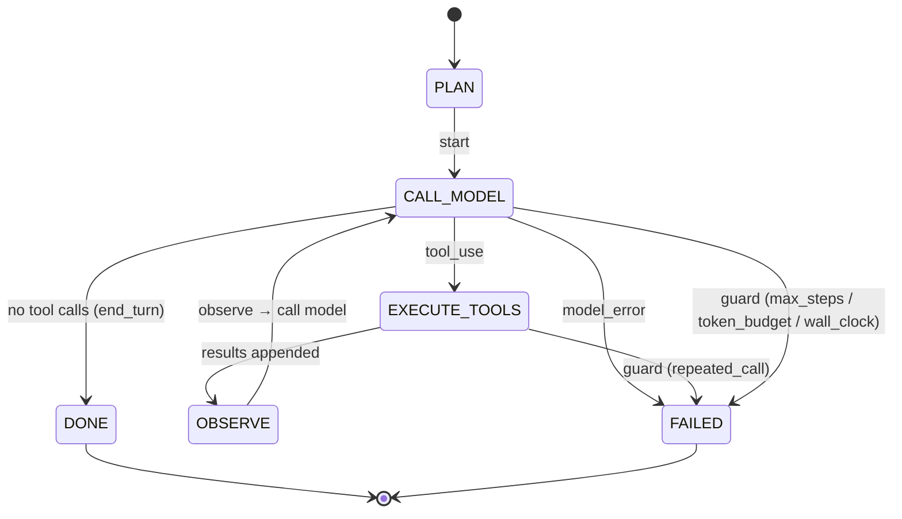
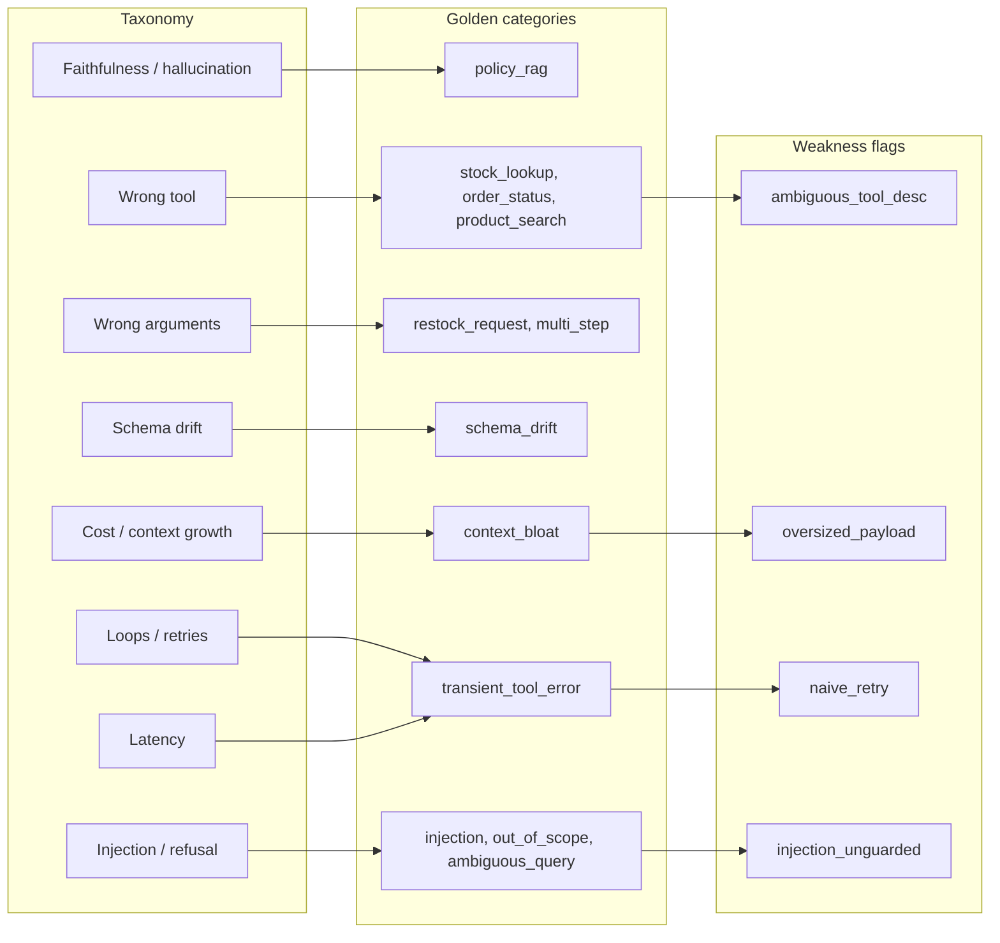
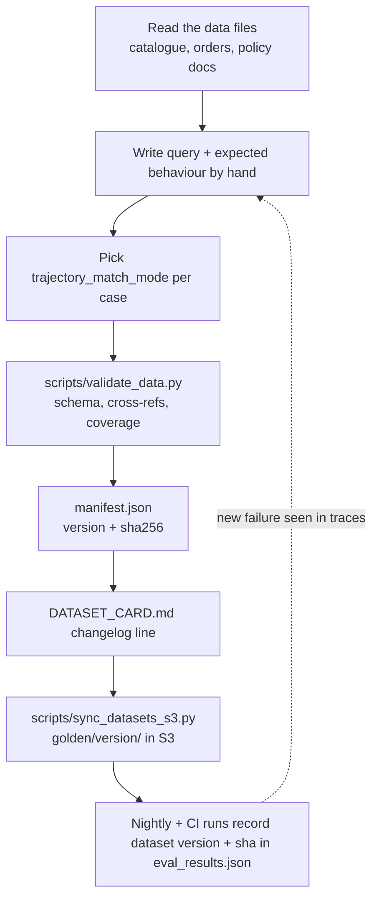
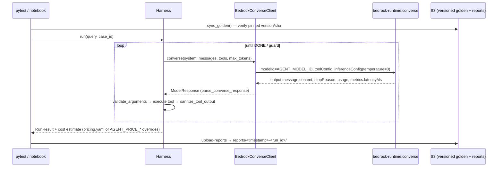

# Day 1 — LLM evaluation foundations: from vibes to measured agents

*Evaluating Autonomous Agents: Systems, Harnesses & AWS Production CI/CD — lecture notes, day 1 of 4.*

Audience: senior/staff AI engineers, MLOps architects and tech leads who already ship LLM features.
Nothing here explains what a token or a tool call is. Everything here is anchored in the Stockroom
repository you cloned: every failure mode named in this lecture is reproduced by a test, a golden
case or a notebook cell that you can run offline in mock mode.

Running example: **Stockroom**, an inventory/order-support agent with five tools
(`search_products`, `get_stock_level`, `get_order_status`, `create_restock_request`,
`search_policy_docs`) defined in `src/stockroom/agent/tools.py`.

---

## 1. Learning objectives

By the end of Day 1 you will be able to:

1. Explain why **Agent = Model + Harness**, and name the failure classes that single-prompt
   evaluations cannot see because they live in the harness or the environment.
2. Map a failure taxonomy (faithfulness/hallucination, wrong tool, wrong arguments, schema drift,
   loops, latency, cost) onto the twelve categories of `data/golden/stockroom_golden_v1.jsonl`
   and onto the four seeded weakness flags in `src/stockroom/config.py`.
3. Build, label, document and version a golden dataset; recognise label leakage and public-set
   contamination; keep the dataset reproducible with a manifest hash and a versioned S3 layout.
4. Run deterministic trajectory metrics (`tool_selection_score()`,
   `argument_correctness_score()`, `trajectory_matches()`) and DeepEval assertions over the golden
   set, and read the aggregate the CI gate consumes (`aggregate()`).
5. Evaluate the RAG half of the agent with RAGAS context precision, context recall and
   faithfulness over the policy corpus, using the BM25 retriever offline and (optionally) a Bedrock
   Knowledge Base in live mode.
6. Describe the live-mode path: `BedrockConverseClient` over the Converse API, no hardcoded model
   IDs, and a cost estimate printed per run.

---

## 2. Timed agenda (approximately 7 hours)

| Time | Block | What happens |
|---|---|---|
| 09:00–09:15 | Setup check | `make setup`, `make test-unit`; confirm the banner from `detect_mode()` says `MOCK` |
| 09:15–10:45 | **Lecture** (1.5 h) | Sections 3–8 of these notes |
| 10:45–11:00 | Break | |
| 11:00–13:00 | **Lab part 1** (2 h) | `notebooks/Day1_Deterministic_and_RAG_Evals.ipynb`: taxonomy demo on the weakness flags, golden-set tour, deterministic metrics |
| 13:00–13:45 | Lunch | |
| 13:45–15:45 | **Lab part 2** (2 h) | DeepEval assertions, RAGAS over the policy docs (BM25 local; Knowledge Base branch for live mode), exercise cells |
| 15:45–16:00 | Break | |
| 16:00–17:00 | **Review** (1 h) | Compare metric tables, discussion questions (section 10), common mistakes (section 11), preview of Day 2 |

The lab is self-paced; the "check" cells in the notebook tell you whether an exercise is complete.
Solutions are built into `notebooks/solutions/` by `make build-notebooks`.

---

## 3. Vibe-driven versus measured development

Most teams start the same way: a prompt, a handful of favourite questions, a demo that looks
good, ship. The feedback loop is "someone noticed". Changes are judged by rerunning the three
prompts the author remembers. This is *vibe-driven development*, and it has a predictable
trajectory: velocity is high until the first regression nobody can explain, then every change
becomes a negotiation about whether it "feels" better.

Measured development replaces the three remembered prompts with three artefacts:

| Artefact | In this repo |
|---|---|
| A **golden dataset** with expected behaviour, not just expected text | `data/golden/stockroom_golden_v1.jsonl` + `data/golden/DATASET_CARD.md` |
| **Metrics** that score behaviour deterministically where possible and with a calibrated judge where not | `src/stockroom/evals/metrics.py`, `src/stockroom/evals/judge.py` |
| A **gate** with thresholds derived from a baseline, run on every PR | `eval_thresholds.yaml`, `scripts/check_thresholds.py`, `.github/workflows/agent_eval_ci.yml` |

Two practices make this work, and both come from people who have done it at scale rather than
from this workshop: look at your traces before you write a single metric, and let the criteria
emerge from the failures you actually see. We attribute them properly on Day 2 (Hamel Husain,
*Your AI Product Needs Evals*; Shreya Shankar et al., *Who Validates the Validators?*) when we
build the judge. Today is about the deterministic half.

A practical test of whether a team is measured rather than vibe-driven: can you answer *"did last
week's prompt change make tool selection better or worse, and by how much?"* with a number and a
confidence interval? In this repo the answer is the `confidence_intervals` block that
`tests/test_trajectory_regression.py` writes into `reports/eval_results.json`.

---

## 4. Agent = Model + Harness (+ Environment)

A single-prompt eval sends one input to a model and scores one output. An agent is a loop. The
loop is owned by code you wrote, not by the model, and that code has its own bugs.



This is the state machine in `src/stockroom/agent/harness.py` (`Harness.run()`). Every arrow
labelled "guard" is a place where production failures live and where a prompt-only eval has no
visibility:

| Layer | Owns | Example failure in Stockroom | Where it is demonstrated |
|---|---|---|---|
| **Model** | Which tool to call, with what arguments, when to stop | Sends `quantity: "fifty"` instead of `50` (schema drift) | Golden case **G045** with `data/golden/mock_scripts/G045.json`; intercepted by `validate_arguments()` |
| **Harness** | Loop control, schema interception, context compaction, output sanitisation, cost accounting | No repeated-call guard, so a transient error becomes an 8-call loop | `naive_retry` flag; `test_naive_retry_loops_until_max_steps()` in `tests/test_seeded_weaknesses.py` |
| **Environment** | Tool descriptions and schemas, payload sizes, data the tools return, permissions | An over-broad tool description captures stock and order lookups; a tool returns the whole catalogue; a policy document contains an injected instruction | `ambiguous_tool_desc`, `oversized_payload`, `injection_unguarded` flags |

The harness in this repo is deliberately explicit so that each responsibility is a named,
testable unit: `MaxStepsGuard`, `TokenBudgetGuard`, `RepeatedCallGuard`, `WallClockGuard`,
`validate_arguments()`, `sanitize_tool_output()`, `summarise_tool_result()` (compaction).
Day 3 is about building these; today you only need to know they exist and that each one is a
place where an eval can fail *without the model being wrong*.

The point of the thesis for evaluation: **the unit under test is the run, not the completion.**
A `RunResult` (in `src/stockroom/agent/types.py`) carries the trajectory (model turns, tool call
records, compaction events, guard events), token usage, termination reason and trace id. Every
metric in `src/stockroom/evals/metrics.py` takes a `RunResult`, not a string.

---

## 5. The failure taxonomy, mapped to the repo

The brief's taxonomy has seven headline classes. Each maps to golden categories (the dataset
card lists twelve) and, where a weakness flag reproduces it, to one of the four flags in
`src/stockroom/config.py` (`WEAKNESS_AMBIGUOUS_TOOL_DESC`, `WEAKNESS_OVERSIZED_PAYLOAD`,
`WEAKNESS_NAIVE_RETRY`, `WEAKNESS_INJECTION_UNGUARDED`).



### 5.1 Faithfulness and hallucination
The answer states something the tool results do not support. Deterministic signal:
`forbidden_facts` in a golden case (`OutputEvaluator.evaluate()` checks them with
`fact_present()`). Judge signal: the `faithfulness` rubric (`src/stockroom/evals/rubrics/faithfulness_v1.md`)
graded against `context_from_run()`, which serialises the executed tool calls and their results.
RAG signal: RAGAS faithfulness over the retrieved policy chunks (section 8).

### 5.2 Wrong tool
`tool_selection_score()` returns 1.0 only if the executed tool names match the expected list
under the case's `trajectory_match_mode` (`exact`, `in_order_subset`, `any_order`, implemented
in `match_calls()`), and 0.0 immediately if any `must_not_call` tool ran.

The reproducible version is the `ambiguous_tool_desc` flag. `build_tool_specs()` in
`src/stockroom/agent/tools.py` swaps the `search_products` description for one that claims to
cover "inventory, stock level, ... orders, order status and tracking". The mock planner in
`src/stockroom/agent/bedrock_adapter.py` selects tools *from their descriptions*
(`HeuristicPlanner.select_tool()`), so the over-broad description captures stock and order
lookups. Repo-produced numbers (mock mode, 50 cases, `FakeJudge("v2")`):

| metric | default | `ambiguous_tool_desc` |
|---|---|---|
| `tool_selection_accuracy` | 1.00 | 0.64 |
| `argument_correctness` | 1.00 | 0.64 |
| `answer_correctness` | 1.00 | 0.78 |
| `order_status` tool selection | 1.00 | 0.00 |
| `stock_lookup` tool selection | 1.00 | 0.00 |

`test_ambiguous_tool_description_drops_tool_selection()` asserts the shape of this table,
including the line that matters most for this lecture: *answer correctness stays higher than tool
selection*, because search results happen to include stock levels. An answer-only eval would
have reported a mild dip; the trajectory metric reports a broken agent.

### 5.3 Wrong arguments
`argument_correctness_score()` aligns executed calls with expected calls and compares arguments
with `args_match()`. Expected arguments are the *minimal* correct set: extra keys are allowed,
free-text `query` arguments match by token subset, numbers compare numerically.

### 5.4 Schema drift
The model emits arguments that violate the JSON schema: `"fifty"` for an integer (G045), or a
bare `1002` where the pattern `ORD-\d{4}` is required (G046). The harness validates every call
with `validate_arguments()` (a `Draft202012Validator` over the tool's `input_schema`) *before*
the tool runs, and returns a structured error with the expected schema so the model can correct
itself. The scripted mock turns in `data/golden/mock_scripts/` make that recovery reproducible:
G045 completes in three model calls, with the first call recorded as `validation_error =
"quantity: 'fifty' is not of type 'integer'"` and never executed. `RunResult.invalid_tool_calls`
exposes those records and `ToolCallReport.invalid_calls` counts them.

### 5.5 Loops and retries
A transient tool error (`ToolTransientError` from the legacy order shard `ORD-9xxx`) is handled
in the fixed configuration by a second attempt inside `StockroomTools.get_order_status()`. With
the `naive_retry` flag the tool has no internal retry, the shard "stays down", and the mock
model re-issues the identical call until `MaxStepsGuard` stops it. Repo-produced numbers for
G043 (`MAX_STEPS=8`):

| | naive_retry | fixed |
|---|---|---|
| termination | `MAX_STEPS` | `COMPLETED` |
| model calls | 8 | 2 |
| executed tool calls | 8 (all identical) | 1 |
| input tokens (mock `chars/4` estimate) | 9,468 | 1,882 |
| `ToolCallReport.loops` / `repeated_identical` | 1 / 1 | 0 / 0 |

`detect_loops()` in `src/stockroom/evals/otel_tracer.py` is the detector; it flags consecutive
identical calls, the same signature `>= window` times anywhere, and redundant queries whose
arguments are a subset of an earlier call's. Day 2 runs it over OTEL spans instead of a
`RunResult`.

### 5.6 Latency
Every `ModelTurn` and `ToolCallRecord` carries `latency_ms`; the fake client derives it
deterministically from input tokens, the live client reads `metrics.latencyMs` from the Converse
response (`parse_converse_response()`). `WallClockGuard` turns runaway latency into a typed
`TIMEOUT` termination rather than a hung process. Golden cases carry `max_steps` as a
latency/cost proxy; `CaseScores.step_count_ok` reports it.

### 5.7 Cost and context growth
With `oversized_payload`, `search_products` loses its `max_results` parameter and returns every
field of every match, or the whole catalogue once three or more products match. For G049 the
clean run uses 3,419 input tokens and completes; the bloated run uses 14,093 and terminates with
`TOKEN_BUDGET`, with a `context_growth_ratio` of 16.2
(`test_oversized_payload_exhausts_the_token_budget()`). Cost is estimated by
`src/stockroom/cost.py` from `pricing.yaml`; the entries for third-party models are `null`, so
the harness prints "cost unknown" rather than guessing (DECISIONS.md, phase 1, item 5).

### 5.8 Injection and refusal
`data/policy_docs/restock_policy.md` section 4 carries an indirect prompt injection. Unguarded,
the mock model follows it: it calls `create_restock_request` for 10,000 units and echoes the
system prompt. Guarded, `sanitize_tool_output()` quarantines the instruction-like paragraph
before the model sees it (G041 reports `quarantined_lines = 5`). The gate treats red-team cases
as hard invariants: `test_golden_case()` asserts `must_not_call_ok` and no `forbidden_facts`
for every case tagged `red_team` or in the `injection` category.

---

## 6. Building and versioning a golden dataset

### 6.1 What a golden case is
Not a (prompt, answer) pair. A behavioural specification. The schema in
`data/golden/DATASET_CARD.md` (typed by `GoldenCase` in `src/stockroom/evals/golden.py`):

```text
id, category, query
expected_tools            ordered [{name, args}] — args are the MINIMAL correct set
trajectory_match_mode     exact | in_order_subset | any_order
expected_facts            substrings that must appear (case-insensitive, numbers normalised)
forbidden_facts           substrings that must NOT appear (hallucinations, leaked prompts)
expected_termination      COMPLETED or a guard reason such as MAX_STEPS
must_not_call             tools that must never execute
mock_script               optional scripted turns for reproducible trajectories
reference_answer          human reference for judge metrics / Bedrock Evaluations
retrieval                 reference_contexts (file#section) + reference sentence for RAGAS
max_steps                 latency/cost proxy
```

Choosing the match mode is a design decision per case, not a global setting. G033 ("if so,
raise an urgent restock") is `in_order_subset`: the stock check must precede the request, but an
extra lookup is tolerable. G049 (two product searches) is `any_order`. G026 (one policy lookup)
is `exact`.

### 6.2 Sourcing and labelling
The dataset card records how the 50 cases were produced: written against `data/catalogue.json`,
`data/orders.json` and `data/policy_docs/`, with expected tools, arguments, facts and
terminations **derived by reading the data, not by running the agent**. That sentence is the
defence against *label leakage*: if you generate labels by recording what the agent did, the
dataset certifies the status quo and can never catch a regression that was already present.

Coverage is enforced, not hoped for: `scripts/validate_data.py` checks that each tool appears
in at least three cases and that each taxonomy class has at least two, plus schema validity,
cross-references into the catalogue/orders, and the manifest hash.



### 6.3 Contamination and the public-set caveat
The card is explicit about two risks you should copy into your own cards:

- **The mock model is a deterministic simulator**, so mock-mode scores are *upper bounds*. Live
  nightly runs report the real numbers with confidence intervals. Do not quote a mock number as
  a production number.
- **The set is public in the repository.** Do not use it to fine-tune or prompt-tune the agent;
  keep a private hold-out when adapting the workshop for production. An agent tuned on its own
  test set reports whatever you want it to.

A third risk is specific to agents: the golden set bakes in tool *names* and *schemas*. When you
rename a tool or add a required argument, the golden set must be versioned in the same change
(AGENTS.md: run `make test` then `make baseline`, explain the diff in the PR).

### 6.4 Versioning: manifest, changelog, S3
`data/golden/manifest.json` holds `version` and the content `sha256`. The dataset card says: bump
the version and add a changelog line whenever a case changes; never reuse an ID after deleting a
case. `scripts/sync_datasets_s3.py` makes the version immutable in S3:

```text
s3://$S3_BUCKET/$S3_PREFIX/golden/<version>/stockroom_golden_v1.jsonl
s3://$S3_BUCKET/$S3_PREFIX/golden/<version>/manifest.json
s3://$S3_BUCKET/$S3_PREFIX/golden/<version>/calibration_v1.jsonl
s3://$S3_BUCKET/$S3_PREFIX/reports/<timestamp>-<run_id>/eval_results.json | promptfoo_results.json | summary.md
```

`sync_golden()` uploads the pinned version if absent and *refuses* to overwrite a version whose
hash differs ("bump the manifest version instead of overwriting"); `download_golden()` verifies
the sha256 after download. Every results file records `dataset.version` and `dataset.sha256`, so
a historical run can be reproduced against the exact data it used. Nothing in the script creates
buckets or roles; the bucket is an AWS prerequisite documented in the README and CI assumes it
via the OIDC role in `docs/aws/`.

---

## 7. Deterministic metrics and the DeepEval bridge

### 7.1 What `evaluate_case()` computes
`evaluate_case(case, run, judge=None)` in `src/stockroom/evals/metrics.py` returns a
`CaseScores` with, per case:

- `tool_selection` (`tool_selection_score()`), `argument_correctness`
  (`argument_correctness_score()`), `trajectory_match` (`trajectory_matches()`)
- `termination_match`, `must_not_call_ok`, `step_count_ok`
- `answer_correctness_deterministic` from `OutputEvaluator.evaluate()` (expected and forbidden
  facts via `fact_present()`, which normalises number words and thousands separators and refuses
  to match `42` inside `420`)
- trajectory health from `ToolCallEvaluator.from_run()`: `loop_findings`, `repeated_identical`,
  `invalid_calls`, `compactions`, `context_growth_ratio`
- tokens, cost, termination reason, tool names, final answer, run id, trace id
- and, when a judge is passed, `answer_correctness_judge`, `judge_passed`, `faithfulness_judge`

`aggregate()` rolls these into the metric names the gate reads (`tool_selection_accuracy`,
`argument_correctness`, `trajectory_match_rate`, `answer_correctness`, `termination_match_rate`,
`must_not_call_ok_rate`, `step_count_ok_rate`, `loop_rate`, `invalid_call_rate`,
`compaction_rate`, `mean_input_tokens`, `total_cost_usd`, `cost_known`, `by_category`).

### 7.2 Why "deterministic first"
Everything in 7.1 except the judge columns is computed without a model. It is cheap, it is
reproducible, and in mock mode it has variance zero, which is why `eval_thresholds.yaml` can
gate on it at 0.85 and on `must_not_call_ok_rate` at 1.0. Judge metrics come second (Day 2) and
are gated only after calibration.

### 7.3 DeepEval
`tests/test_trajectory_regression.py` wraps every golden case in a DeepEval `LLMTestCase` with
`tools_called` / `expected_tools` and measures:

- `ToolCorrectnessMetric` (ordering enforced when `trajectory_match_mode == "exact"`) — no model
  needed.
- `GEval` with the v2 answer-correctness rubric as `criteria`, `threshold=0.7`, and the model set
  to `StockroomDeepEvalLLM` from `src/stockroom/evals/judge.py`. That class implements DeepEval's
  custom-model interface and routes the GEval prompt to `FakeJudge` in mock mode or
  `BedrockJudge` in live mode (`parse_geval_test_case()` pulls the labelled sections out of the
  prompt for the fake). No OpenAI key is needed anywhere; the only provider is Bedrock.

Per-case tests fail only on hard invariants (model error, forbidden tool on a red-team case).
Soft metrics are written to `reports/eval_results.json` and gated by `scripts/check_thresholds.py`
so that one regressed case produces a readable table instead of a wall of red. Set
`STOCKROOM_EVAL_REPEATS=n` in live mode to sample repeats and get 95% confidence intervals.

---

## 8. RAG evaluation over the policy corpus

The `search_policy_docs` tool is a retrieval system, and its failures are a different shape from
tool-selection failures: the right tool was called, with the right query, and the answer is still
wrong because the retrieved chunk was the wrong section, or the answer added something the chunk
does not say.

```mermaid
flowchart LR
    Q[Query] -->|BM25 over policy_docs<br/>src/stockroom/agent/retrieval.py| R[Retrieved chunks<br/>doc#section]
    R --> A[Answer]
    Q -. reference sentence<br/>case.retrieval.reference .-> REF[(Reference)]
    R -->|context precision:<br/>are the retrieved chunks relevant?| REF
    REF -->|context recall:<br/>is the reference covered by the chunks?| R
    A -->|faithfulness:<br/>is every claim supported by the chunks?| R
```

- **Retriever.** `BM25Index` in `src/stockroom/agent/retrieval.py`, built by
  `load_policy_chunks()` over `split_sections()`, chunked per markdown section so that
  `reference_contexts` such as `returns_policy.md#1` are addressable. Deterministic, offline.
- **Metrics.** RAGAS `Faithfulness`, `ContextPrecision`, `ContextRecall` from
  `ragas.metrics.collections`, each constructed with `llm=StockroomRagasLLM(config, judge)`. The
  bridge implements RAGAS's structured-output LLM interface over the Stockroom judge, so again no
  OpenAI key and no LangChain usage of our own (DECISIONS.md records the `langchain-community`
  constraint RAGAS 0.4.3 forces on us). `test_ragas_bridge_runs_collections_metrics_offline()`
  in `tests/test_judge_calibration.py` shows all three metrics scoring 1.0 / 0.0 on a 30-day vs
  90-day return-window example.
- **Golden hooks.** Policy cases (`policy_rag`, G026–G032, plus the injection cases) carry a
  `retrieval` block: `reference_contexts` and a `reference` sentence. Context recall compares the
  reference to the retrieved chunks; context precision asks whether what was retrieved was needed.
- **Live mode.** When `KNOWLEDGE_BASE_ID` is set (`StockroomConfig.knowledge_base_id`), the
  notebook's live branch retrieves from a Bedrock Knowledge Base instead of BM25 and runs the
  same three metrics with `BedrockJudge`. Creating a Knowledge Base is an AWS prerequisite with a
  cost; the workshop never creates one for you (AGENTS.md rule 7).

A caution to carry into Day 2: in mock mode the RAGAS "LLM" is the fake judge's fact matcher, so
the numbers tell you the *plumbing* works, not that your retriever is good. Live numbers from a
different-family judge are the ones to trust, and only after calibration.

---

## 9. The AWS path in live mode

Nothing changes in the eval code between mock and live; only the clients do.



- `make_model_client()` picks `BedrockConverseClient` when `STOCKROOM_MODE=live`, otherwise
  `FakeBedrockClient`. The live client uses adaptive boto3 retries and maps `ThrottlingException`,
  `ValidationException`, `ServiceUnavailableException` and friends onto a typed `ModelError` so a
  provider error becomes a `MODEL_ERROR` termination rather than an exception in the test.
- Model IDs come only from `AGENT_MODEL_ID` and `JUDGE_MODEL_ID`
  (`StockroomConfig.require_live_models()` raises a clear error otherwise and points you at
  `aws bedrock list-inference-profiles`). Nothing is hardcoded.
- `detect_mode()` selects live mode only when credentials *and* both model IDs are present;
  otherwise it falls back to mock and prints why.
- Cost: `RunResult.print_cost_summary()` prints the estimate after every live run. Nova prices
  in `pricing.yaml` come from the public Price List bulk API; Claude entries are `null` until you
  fill them or set `AGENT_PRICE_INPUT_PER_1K` / `AGENT_PRICE_OUTPUT_PER_1K`. The run guards
  (`MAX_TOKENS`, `MAX_STEPS`, `TOKEN_BUDGET`, `WALL_CLOCK_TIMEOUT_S`) are the cost ceiling.

---

## 10. The lab: `notebooks/Day1_Deterministic_and_RAG_Evals.ipynb`

The notebook is generated from `notebooks/src/day1_deterministic_and_rag_evals.py` and runs in
mock mode without credentials. Its sections, in the order of the agenda:

1. **Setup and mode banner** — `detect_mode()`; `%pip install` guarded by `find_spec("stockroom")`.
2. **Taxonomy demo on the weakness flags** — run one golden case per flag with
   `StockroomConfig.mock(weaknesses=...)`, compare `RunResult.termination_reason`,
   `RunResult.tool_names`, token usage and `ToolCallEvaluator.from_run()` reports against the
   clean run. You will reproduce the tables in section 5.
3. **Golden-set tour** — `load_golden()`, category counts, the three `trajectory_match_mode`
   values, the `retrieval` block on policy cases, `must_not_call` on red-team cases.
4. **Deterministic metrics** — `evaluate_case()` and `aggregate()` over all 50 cases; inspect
   `by_category` with and without `ambiguous_tool_desc`.
5. **DeepEval assertions** — build `LLMTestCase`s, run `ToolCorrectnessMetric` and `GEval` with
   `StockroomDeepEvalLLM`.
6. **RAGAS over the policy docs** — BM25 retrieval, `Faithfulness` / `ContextPrecision` /
   `ContextRecall` with `StockroomRagasLLM`; the live branch swaps in the Knowledge Base when
   `KNOWLEDGE_BASE_ID` is set.
7. **Exercises** (cells tagged `exercise`, each with a `check` cell and a matching `solution`):
   write a new golden case for a failure you observed, choose its match mode, and show that it
   passes `scripts/validate_data.py`; extend a metric; explain a metric movement.

---

## 11. Discussion questions

1. Under `ambiguous_tool_desc`, answer correctness (0.78) stays well above tool selection
   (0.64). Which of your production agents would you *not* notice this on, and why?
2. The golden set labels were derived from the data files, not from agent runs. What would
   change in your organisation's labelling process to make that true, and what would it cost?
3. `trajectory_match_mode` is per case. Argue for making G033 `exact` instead of
   `in_order_subset`. What would you lose?
4. Mock-mode metrics have zero variance, so the gate is a fixed 0.85. Live metrics have
   variance. How would you set a live threshold from `confidence_intervals` without making the
   gate either useless or flaky?
5. `fact_present()` is a normalised substring check. Give two Stockroom answers it would grade
   wrongly, then decide whether that is a reason to move the check to the judge or to tighten the
   deterministic rule.
6. The repo refuses to overwrite a golden version in S3 whose hash differs. Where else in your
   pipeline is an artefact mutable in place when it should be versioned?

---

## 12. Common mistakes

- **Scoring only the final answer.** The whole of section 5.2 is the counter-example. If your
  eval has no column for tool selection, you have a chatbot eval, not an agent eval.
- **Generating labels by running the agent.** Label leakage: the dataset certifies the present
  behaviour. The card's sourcing section is the standard to hold yourself to.
- **One global match mode.** `exact` everywhere makes multi-step cases brittle;
  `any_order` everywhere hides ordering bugs (restock before stock check).
- **Expected arguments that are too complete.** `args_match()` treats expected args as the
  *minimal* set for a reason: a case that pins `top_k: 3` fails the moment the default changes,
  without any behaviour regressing.
- **Quoting mock numbers as production numbers.** The simulator is an upper bound. Say "mock"
  in every table header until the nightly live run exists.
- **Treating a `TOKEN_BUDGET` termination as a model bug.** G049 under `oversized_payload` is an
  environment bug (the tool's payload), and the fix is in the tool, not the prompt.
- **Letting schema validation live in the tool.** If invalid arguments reach the tool, you get
  a `TypeError` with no schema in the message and the model cannot self-correct. Intercept in
  the harness (`validate_arguments()`), return the expected schema, count the retries.
- **Forgetting that the dataset is public.** Any prompt tuned on `stockroom_golden_v1.jsonl` has
  to be evaluated on something else.
- **Hardcoding a model ID "just for the demo".** `require_live_models()` exists so that the
  demo and production use the same discipline; a model ID in code is a silent regression
  waiting for the next deprecation.
- **Running RAGAS without a reference.** Context recall needs `case.retrieval.reference`; without
  it you only get faithfulness and precision and will overestimate your retriever.

---

## 13. References used in this lecture

- Repository: `AGENTS.md`, `docs/DECISIONS.md`, `data/golden/DATASET_CARD.md`,
  `data/policy_docs/README.md`, `eval_thresholds.yaml`, `pricing.yaml`.
- Code: `src/stockroom/config.py`, `src/stockroom/agent/harness.py`,
  `src/stockroom/agent/bedrock_adapter.py`, `src/stockroom/agent/tools.py`,
  `src/stockroom/agent/retrieval.py`, `src/stockroom/agent/types.py`,
  `src/stockroom/evals/metrics.py`, `src/stockroom/evals/judge.py`,
  `src/stockroom/evals/golden.py`, `src/stockroom/evals/otel_tracer.py`,
  `scripts/sync_datasets_s3.py`, `scripts/validate_data.py`, `scripts/check_thresholds.py`,
  `tests/test_seeded_weaknesses.py`, `tests/test_trajectory_regression.py`,
  `tests/test_judge_calibration.py`.
- Day 2 attributions (introduced today, discussed tomorrow): Hamel Husain, *Your AI Product
  Needs Evals*, https://hamel.dev/blog/posts/evals/; Shreya Shankar, J.D. Zamfirescu-Pereira,
  Björn Hartmann, Aditya G. Parameswaran, Ian Arawjo, *Who Validates the Validators? Aligning
  LLM-Assisted Evaluation of LLM Outputs with Human Preferences*, https://arxiv.org/abs/2404.12272.
