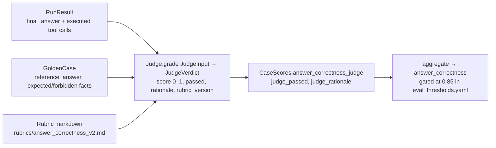
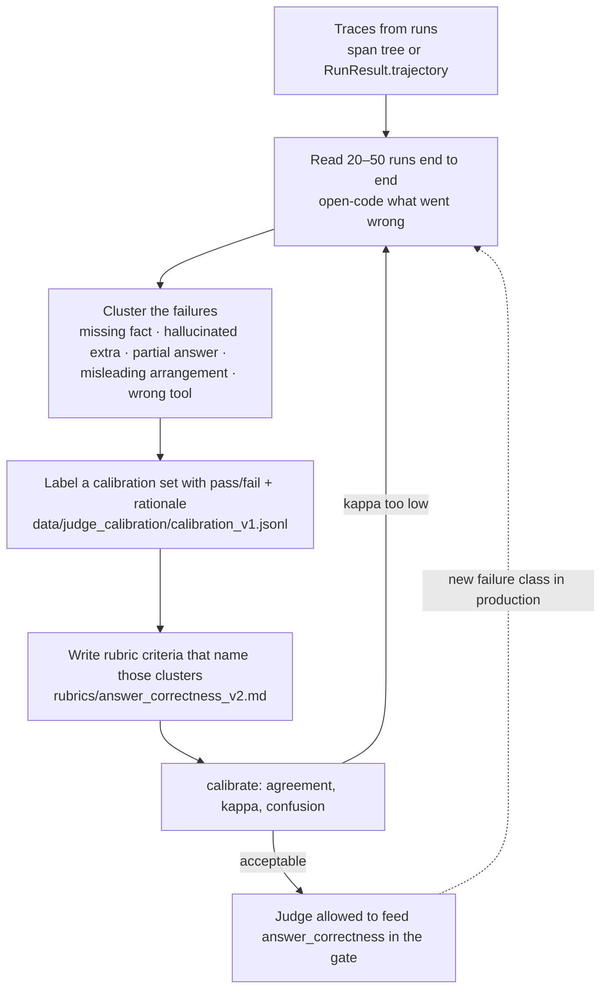
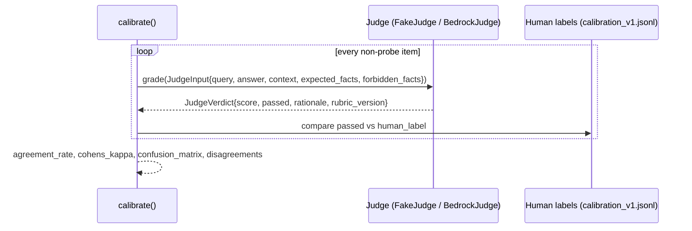
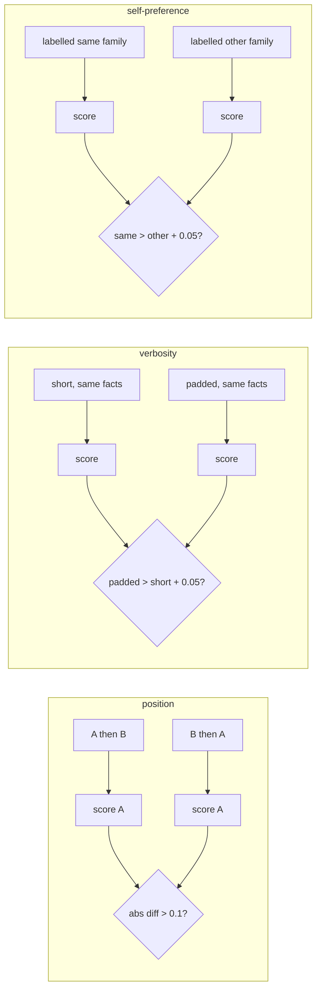
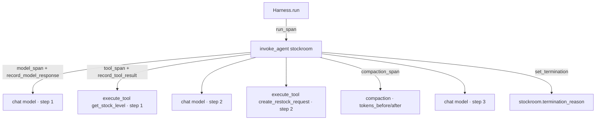
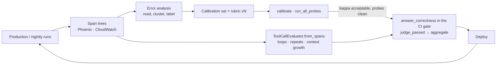

# Day 2 — LLM-as-a-judge, calibration and OpenTelemetry traces

*Evaluating Autonomous Agents: Systems, Harnesses & AWS Production CI/CD — lecture notes, day 2 of 4.*

Day 1 covered the deterministic half of the eval suite: trajectory metrics that need no model.
Day 2 covers the two things you cannot do deterministically: grading free-form,
non-deterministic, multi-turn output, and *seeing* what an agent did in production. The first
needs a judge you have calibrated against humans; the second needs a span tree per run that
follows a convention other tools understand.

Everything in this lecture runs offline in mock mode with `FakeJudge` and the in-memory span
exporter. The live path (a Bedrock judge from a different model family, Arize Phoenix locally,
CloudWatch GenAI observability via ADOT) is described with exactly what the vendor pages say and
nothing more.

---

## 1. Learning objectives

By the end of Day 2 you will be able to:

1. Explain why grading agent output is a measurement problem (non-determinism, multi-turn
   context, "string-correct but misleading" answers) and why a judge is a *model of the human
   label*, not ground truth.
2. Practise **error analysis before metrics**: read traces, cluster failures, and only then
   write rubric criteria — as described by Hamel Husain and by Shankar et al.
3. Calibrate a judge against human labels with agreement rate, Cohen's kappa and a confusion
   matrix (`calibrate()`, `cohens_kappa()`, `confusion_matrix()` in
   `src/stockroom/evals/calibration.py`), and show the rubric v1 → v2 change moving kappa from
   0.25 to 0.83 on `data/judge_calibration/calibration_v1.jsonl`.
4. Probe a judge for position, verbosity and self-preference bias
   (`position_bias_probe()`, `verbosity_bias_probe()`, `self_preference_probe()`).
5. Argue the trade-off between binary pass/fail rubrics and Likert-style scores, and read the
   repo's 0–10-with-threshold design (`src/stockroom/evals/rubrics/`) in that light.
6. Emit one OpenTelemetry span tree per run following the GenAI semantic conventions
   (`src/stockroom/evals/semconv.py`), inspect it in memory, in Arize Phoenix, and (live) in
   CloudWatch; and run `ToolCallEvaluator.from_spans()` over the trace to detect loops, repeated
   calls, redundant queries and context growth.

---

## 2. Timed agenda (approximately 7 hours)

| Time | Block | What happens |
|---|---|---|
| 09:00–09:15 | Recap | Day 1 metric tables; what `answer_correctness_judge` was `None` for and why |
| 09:15–10:45 | **Lecture** (1.5 h) | Sections 3–9 of these notes |
| 10:45–11:00 | Break | |
| 11:00–13:00 | **Lab part 1** (2 h) | `notebooks/Day2_Judge_Calibration_and_OTEL_Traces.ipynb`: spans per model/tool call (memory exporter, optional Phoenix), `ToolCallEvaluator` over traces |
| 13:00–13:45 | Lunch | |
| 13:45–15:45 | **Lab part 2** (2 h) | Error analysis on the calibration set, calibrate the judge before/after the rubric change, bias probes, exercise cells |
| 15:45–16:00 | Break | |
| 16:00–17:00 | **Review** (1 h) | Compare kappa tables and probe results, discussion questions (section 11), common mistakes (section 12), preview of Day 3 |

---

## 3. Grading non-deterministic, multi-turn output

Three properties of agent output make string comparison insufficient:

1. **Non-determinism.** Even at `temperature: 0.0` (which `BedrockConverseClient.converse()`
   sets), the same query can yield different tool orderings, different phrasings, and different
   numbers of steps across model versions and regions. The reference answer is one of many
   acceptable answers.
2. **Multi-turn context.** The final answer is conditioned on tool results the grader must see.
   "ORD-1001 was delivered" is correct or hallucinated depending on what `get_order_status`
   returned. `context_from_run()` in `src/stockroom/evals/metrics.py` serialises the executed
   calls and results into the judge's `context` field for exactly this reason.
3. **String-correct but misleading.** Items C23–C24 in the calibration set contain every
   expected fact and are still wrong for a human: the facts are arranged into a false
   conclusion. Rule-based graders cannot catch this; it is the reason a judge exists at all, and
   also the reason the fake judge's v2 rubric still disagrees with humans on exactly those two.

The practical consequence: a judge verdict is a **prediction of the human label**. It has a
precision and a recall, it can be biased, and it has to be validated like any other classifier
before its output is allowed to gate a deployment. That is the whole of section 5.



---

## 4. Error analysis before metrics

The most common failure in eval programmes is writing the rubric first. Two sources describe the
alternative; both links were checked while writing these notes.

**Hamel Husain, *Your AI Product Needs Evals*** (https://hamel.dev/blog/posts/evals/). The post
argues that successful AI products depend on a domain-specific evaluation system rather than on
prompt engineering, and organises evaluation into three levels: *Level 1: Unit Tests* (fast,
cheap assertions run frequently), *Level 2: Human & Model Eval* (trace logging combined with
human review and model-based critiques), and *Level 3: A/B Testing*. Two of its instructions map
directly onto this repo: "critically examine your traces and failure modes" when deciding which
assertions to write, and "you must remove all friction from the process of looking at data" —
build the viewer your domain needs rather than reading JSON. Day 1's deterministic metrics are
his Level 1; today's calibrated judge is his Level 2.

**Shreya Shankar, J.D. Zamfirescu-Pereira, Björn Hartmann, Aditya G. Parameswaran, Ian Arawjo,
*Who Validates the Validators? Aligning LLM-Assisted Evaluation of LLM Outputs with Human
Preferences*** (https://arxiv.org/abs/2404.12272). The paper starts from the observation that
LLM-generated evaluators inherit the problems of the LLMs they evaluate, and presents
**EvalGen**, a mixed-initiative interface that generates candidate evaluation implementations
(code assertions and prompt-based graders) and then solicits human grades on selected outputs to
pick the implementations that best match human preferences. Its central finding for us is
**criteria drift**: users need criteria to grade outputs, but grading outputs is what lets users
define the criteria. Evaluation standards emerge from reviewing real outputs; they are not fully
known up front.

What this means operationally in Stockroom:



The calibration set's README is honest about how it was built: labels were written by the
workshop authors from the context shown, and the items *deliberately* include paraphrases
(C21–C22), hallucinated extras (C09–C12), partial answers (C13–C16) and two misleading-but-
string-correct items (C23–C24) "so that agreement with the human labels is informative rather
than trivially 100%". Those four clusters are the output of error analysis. The v2 rubric's
numbered criteria (key facts, contradictions, scope, verbosity is not quality) are a one-to-one
transcription of them. That is what "error analysis before metrics" looks like in a file.

---

## 5. Judge calibration against human labels

### 5.1 The measurements
`src/stockroom/evals/calibration.py`:

- `agreement_rate()` — fraction of items where the judge's `passed` equals the human label.
  Easy to read, misleading when labels are imbalanced.
- `cohens_kappa()` — agreement corrected for chance: `(p_o - p_e) / (1 - p_e)` with `p_e`
  computed from the two raters' marginal pass rates. 1 is perfect, 0 is chance.
- `confusion_matrix()` — a `ConfusionMatrix` with `tp` (human pass, judge pass), `fp` (human
  fail, judge pass), `fn` (human pass, judge fail), `tn`. `fp` is the dangerous cell for a gate:
  a lenient judge passes answers humans would reject.
- `calibrate(judge, items)` — grades every non-probe item via `to_judge_input()` and returns a
  `CalibrationReport` with all three, the list of disagreements `(id, human, judge, rationale)`,
  and every verdict. `CalibrationReport.summary()` prints the table.

### 5.2 Rubric v1 → v2 on the repo's calibration set
`FakeJudge` in `src/stockroom/evals/judge.py` is deliberately imperfect so that calibration
shows real movement. Rubric v1 passes any answer containing at least half of the key facts; v2
requires every key fact and no forbidden/contradicting content (`FakeJudge.grade()`). Repo-
produced numbers (`calibrate()` over the 24 non-probe items; reproduced by
`test_calibration_improves_from_v1_to_v2()` in `tests/test_judge_calibration.py`):

| | rubric v1 | rubric v2 |
|---|---|---|
| agreement | 58.3% | 91.7% |
| Cohen's kappa | **0.250** | **0.833** |
| confusion (tp / fn / fp / tn) | 10 / 0 / 10 / 4 | 10 / 0 / 2 / 12 |
| disagreements | C09–C16, C23, C24 | C23, C24 |

Read the v1 column carefully: 58% agreement sounds mediocre; kappa 0.25 says it is barely above
chance, because v1 passes *everything* (14 of 14 judge-pass on 10 human-pass). The ten false
positives are exactly the hallucinated-extras and partial-answer clusters. v2's two remaining
disagreements are the misleading-arrangement items that no fact matcher can catch; a real
model-based judge with the v2 rubric is what you test against those in live mode.

The live judge, `BedrockJudge`, sends the rubric markdown plus query/answer/reference/context
through the Converse API (`BedrockJudge.complete()`), parses the JSON verdict with
`parse_json_object()`, and normalises a 0–10 score to 0–1. `load_rubric(name, version)` is the
only place rubric text is read, so a rubric change is a file diff with a version in its name,
and `JudgeVerdict.rubric_version` is recorded on every verdict and in `eval_results.json`
(`"judge": "<name>:<version>"`).



### 5.3 Binary pass/fail versus Likert scores
The rubrics in `src/stockroom/evals/rubrics/` ask for both: a 0–10 score *and* a boolean
`pass`, with the threshold stated in the rubric (v2 answer correctness: pass requires 7 or more;
faithfulness v1: 8 or more and no contradiction). Everything that gates is binary:
`calibrate()` compares `passed`, kappa is computed on booleans, `aggregate()` turns
`judge_passed` into `answer_correctness`. The score is kept for diagnostics
(`answer_correctness_judge_mean_score`, `faithfulness_mean_score`) and for DeepEval's GEval,
which expects a 0–10 (`schema_fill_from_verdict()` maps the verdict either way).

The trade-off, stated plainly:

| | Binary pass/fail | Likert / 0–10 |
|---|---|---|
| Human labelling | Fast; two annotators agree more often; kappa is well defined | Slow; "7 vs 8" disagreements dominate; needs weighted kappa or correlation |
| Judge consistency | Threshold hides small score noise | Scores drift between model versions and even between runs |
| What it can express | One decision per criterion | Gradation ("all facts, minor unsupported detail") |
| How to gate on it | Pass rate with a threshold from baseline variance | Needs a cut-off anyway, so it becomes binary at the gate |

The repo's position: decide *in the rubric* what passes, let the model explain its score, gate on
the boolean, and keep the score to see *how* close borderline items are during error analysis.
If you want gradation to matter, write it as several binary criteria (facts present /
no contradiction / scope covered) rather than one 10-point scale.

### 5.4 Why the judge is a different model family from the agent
A judge that shares a model family with the agent shares its blind spots and its stylistic
preferences; the self-preference probe below measures the second. The repo's default in live
mode is therefore a Claude agent and an Amazon Nova judge, which the README will document and
which `StockroomConfig.require_live_models()` already shows in its error message
(`AGENT_MODEL_ID=us.anthropic.claude-haiku-4-5-20251001-v1:0 JUDGE_MODEL_ID=us.amazon.nova-pro-v1:0`
as an example — not a default baked into code). Both run on Bedrock; no OpenAI key is needed
for any judge, DeepEval or RAGAS path.

---

## 6. Probing the judge for bias

Calibration tells you *whether* the judge agrees with humans on the sampled items; probes tell
you *whether it can be gamed*. The calibration set reserves items 25–32 for three probe groups,
and `run_all_probes()` runs all three. Each returns `ProbeResult(probe, group, detail, biased)`.

| Probe | Construction (calibration README) | Detector | Biased when |
|---|---|---|---|
| **Position** `position:P1` / `position:P1-swapped` | The same two answers presented in both orders | `position_bias_probe()` scores the preferred answer when shown first and when shown second | the two scores differ by more than 0.1 |
| **Verbosity** `verbosity:V1` | Identical facts, short vs padded wording | `verbosity_bias_probe()` | verbose scores more than short + 0.05 |
| **Self-preference** `self_pref:S1` | Identical answers; the query is prefixed with "[Answer produced by the same model family as you]" vs "a different model family" | `self_preference_probe()` | same-family scores more than other-family + 0.05 |



Two honest caveats the lab makes explicit:

- The **fake judge is immune by construction** — it never sees position, length or the family
  label (`test_bias_probes_report_no_bias_for_fake_judge()` asserts `biased is False` for all
  three). The probes exist so that in live mode you run them against the *real* judge, where
  the outcome is not known in advance. Do not read "no bias" in mock mode as a result.
- A probe with one pair per group (as shipped) is a smoke test, not a measurement. Before you
  trust a live judge, add pairs until a biased verdict would be unlikely to be noise.

---

## 7. Observability: one span tree per run

### 7.1 The GenAI semantic conventions
`src/stockroom/evals/otel_tracer.py` emits, per run:

```text
invoke_agent stockroom                      gen_ai.operation.name=invoke_agent, gen_ai.agent.name, gen_ai.conversation.id=run_id
├── chat {model}                            gen_ai.operation.name=chat, gen_ai.request.model, gen_ai.usage.input_tokens / output_tokens,
│                                           gen_ai.response.finish_reasons, stockroom.step, stockroom.context_tokens_estimate
├── execute_tool {tool}                     gen_ai.operation.name=execute_tool, gen_ai.tool.name, gen_ai.tool.call.id,
│                                           gen_ai.tool.call.arguments, gen_ai.tool.call.result, error.type on failure
├── compaction                              stockroom.compaction.tokens_before / tokens_after
└── ...                                     root: stockroom.termination_reason, stockroom.weaknesses, status ERROR if not COMPLETED
```

The attribute and span names live in `src/stockroom/evals/semconv.py` and come from the
OpenTelemetry GenAI semantic conventions repository,
https://github.com/open-telemetry/semantic-conventions-genai (the pages
https://github.com/open-telemetry/semantic-conventions-genai/blob/main/docs/gen-ai/gen-ai-spans.md
and
https://github.com/open-telemetry/semantic-conventions-genai/blob/main/docs/gen-ai/gen-ai-agent-spans.md).
Facts worth stating precisely:

- The conventions' status is **Development**. The names can change; that is why the repo spells
  them out in one module instead of importing from `opentelemetry.semconv._incubating`, and why
  `test_semconv_names_match_installed_package_when_available()` in `tests/test_tracer.py`
  cross-checks them against the installed package when it is present.
- Span names follow `{operation} {target}`: `chat {gen_ai.request.model}`,
  `execute_tool {gen_ai.tool.name}`, `invoke_agent {gen_ai.agent.name}`.
- `gen_ai.provider.name` has well-known values that include `aws.bedrock`; the fake client
  reports `stockroom.fake` so mock traces are never mistaken for live ones
  (`PROVIDER_AWS_BEDROCK`, `PROVIDER_FAKE` in `src/stockroom/evals/semconv.py`).
- Workshop-specific attributes are namespaced `stockroom.*` so they cannot collide with a
  future `gen_ai.*` name.
- `openinference.span.kind` (`LLM`, `TOOL`, `AGENT`, `CHAIN`) is set alongside the `gen_ai.*`
  attributes for viewers that predate automatic conversion; Phoenix ≥ 15.10 converts `gen_ai.*`
  spans to OpenInference automatically.



`RunTracer` wraps every state transition of the harness (`run_span()`, `model_span()`,
`tool_span()`, `compaction_span()`, `set_termination()`), and `record_model_response()` /
`record_tool_result()` copy token usage, finish reasons, arguments, results and error types onto
the spans. `test_span_tree_per_run()` asserts the shape: one `invoke_agent`, one `chat` per
model call, one `execute_tool` per tool call, trace id equal to `RunResult.trace_id`.

### 7.2 Exporters
`configure_tracing(exporter)` returns a `TracingHandle` with an isolated provider:

| `STOCKROOM_TRACE_EXPORTER` | Where spans go | Use |
|---|---|---|
| `memory` | `InMemorySpanExporter`; `TracingHandle.finished_spans()` | tests, notebooks, evals (default) |
| `console` | JSON on stdout | debugging |
| `phoenix` | OTLP/HTTP to `PHOENIX_COLLECTOR_ENDPOINT` or `http://localhost:6006/v1/traces` | local trace viewer |
| `cloudwatch` | the global provider ADOT installs under `opentelemetry-instrument`, else OTLP/HTTP to `OTEL_EXPORTER_OTLP_ENDPOINT` | live mode |
| `none` | dropped | |

**Arize Phoenix locally.** Start it with `uvx arize-phoenix serve` (or `make phoenix`, which
runs the same server from the repo's `phoenix` extra), set
`STOCKROOM_TRACE_EXPORTER=phoenix`, run anything, and open http://localhost:6006. The OTLP
endpoint is `http://localhost:6006/v1/traces`. Phoenix is an optional extra
(`uv sync --extra phoenix`); CI installs without it.

**CloudWatch GenAI observability in live mode.** The repo follows the AWS page *Add
observability to your Amazon Bedrock AgentCore resources*
(https://docs.aws.amazon.com/bedrock-agentcore/latest/devguide/observability-configure.html),
section "Enabling observability for agents hosted outside of AgentCore", and states only what
that page says:

- Add the ADOT SDK: `aws-opentelemetry-distro>=0.18.0` (plus `boto3`) to your dependencies.
  In this repo that is the `cloudwatch` extra, which conflicts with the `phoenix` extra because
  ADOT pins `opentelemetry-sdk==1.44.0` (DECISIONS.md, phase 1, item 3) — install one or the other.
- Run the process under auto-instrumentation: `opentelemetry-instrument python app.py`.
- Set the OTEL environment variables the page lists, including:
  `AGENT_OBSERVABILITY_ENABLED=true`, `OTEL_PYTHON_DISTRO=aws_distro`,
  `OTEL_PYTHON_CONFIGURATOR=aws_configurator`, `OTEL_EXPORTER_OTLP_PROTOCOL=http/protobuf`,
  `OTEL_TRACES_EXPORTER=otlp`, and
  `OTEL_EXPORTER_OTLP_LOGS_HEADERS=x-aws-log-group=<your agent log group>,x-aws-log-stream=runtime-logs,x-aws-metric-namespace=bedrock-agentcore`.
  The page also lists `OTEL_RESOURCE_ATTRIBUTES` (service name and log group names) and an
  optional `OTEL_EXPORTER_OTLP_TRACES_HEADERS` to direct spans to your own log group.
- Enable CloudWatch Transaction Search once per account (console, or
  `aws xray update-trace-segment-destination --destination CloudWatchLogs` after adding the
  resource policy the page shows). The page states that the ADOT Collector is not supported for
  agent observability; use the SDK (or the Lambda layer).
- Traces then appear on the CloudWatch GenAI Observability page.

`configure_tracing(TraceExporter.CLOUDWATCH)` detects `OTEL_PYTHON_DISTRO=aws_distro` and reuses
the provider ADOT installed rather than creating a second one. The authoring machine could not
exercise this path end to end (TASKS.md, known gaps); it is documented and unit-tested with
stubs, so treat the live CloudWatch screenshots you take in the lab as the first real evidence.

### 7.3 From spans back to metrics
`TraceSummary.from_spans(spans, run_id)` rebuilds the list of model calls (with token counts
and context estimates) and tool calls (name, arguments, step, error flag, latency) from a
finished trace, selecting spans by walking up to the `invoke_agent` root that carries the run id.
`ToolCallEvaluator.from_spans()` then produces the same `ToolCallReport` as
`ToolCallEvaluator.from_run()` — `test_trace_summary_and_evaluator_agree_with_run()` asserts
they agree — with:

- `repeated_identical` — consecutive identical `name:arguments` signatures
- `loops` — the same signature at least `window` (default 3) times anywhere
- `redundant_queries` — a later call whose arguments are a strict subset of an earlier call's
- `context_tokens_first`, `context_tokens_last`, `context_growth_ratio`, `max_context_tokens`,
  `compactions`

This is the bridge between observability and evaluation: the same detector (`detect_loops()`)
that flags a loop in a golden-set run can run over production traces exported from Phoenix or
CloudWatch, with no agent code in the loop. `span_tree()` renders the tree as indented text for
notebooks.

---

## 8. Putting the two halves together



Day 3 adds the harness fixes that make the trajectory metrics move; Day 4 adds synthetic case
generation (filtered by the calibrated judge), the Promptfoo red team, thresholds from baseline
variance, and the Bedrock Evaluations job builder.

---

## 9. Grading multi-turn runs: what the judge sees and what it does not

`evaluate_case()` calls the judge twice when one is supplied: once with
`rubric="answer_correctness"` (query, final answer, reference, context, expected and forbidden
facts) and, if any tool ran, once with `rubric="faithfulness"` (answer against
`context_from_run()`). Note what is deliberately *not* in the judge's input: the intermediate
model turns, the guard events, the number of steps. Those are scored deterministically. Sending
the whole trajectory to a judge invites it to grade the process by style ("the agent was
thorough") rather than the outcome by evidence, and makes the verdict depend on trajectory length
— the verbosity bias in another form. If you need process judgements (Day 3: "did the agent ask
for the SKU instead of guessing?"), write them as separate binary criteria over specific spans.

---

## 10. The lab: `notebooks/Day2_Judge_Calibration_and_OTEL_Traces.ipynb`

Generated from `notebooks/src/day2_judge_calibration_and_otel_traces.py`; runs in mock mode
without credentials. Sections:

1. **Spans per model and tool call** — `configure_tracing("memory")`,
   `RunTracer(handle)`, run a multi-step case, print `span_tree()`, inspect the `gen_ai.*`
   attributes; optional cell to switch to `phoenix` with Phoenix running locally.
2. **`ToolCallEvaluator` over traces** — `TraceSummary.from_spans()` and
   `ToolCallEvaluator.from_spans()` on a clean run, on the `naive_retry` loop (8 identical
   calls, `loops=1`), and on the `oversized_payload` run (`context_growth_ratio > 5`).
3. **Error analysis on the calibration set** — read the 24 labelled items and their rationales
   before touching the rubric; group the failure clusters.
4. **Calibrate before/after the rubric change** — `calibrate(FakeJudge("v1"), items)` vs
   `calibrate(FakeJudge("v2"), items)`; print `CalibrationReport.summary()`; inspect
   `disagreements`.
5. **Bias probes** — `run_all_probes()`; discuss why the fake judge is immune and what to do in
   live mode.
6. **Exercises** (tagged `exercise`, each with `check` and `solution` cells): write a rubric
   criterion for one of the C23/C24 items and argue whether a fact matcher could ever implement
   it; add a probe pair; turn a loop finding from a trace into a golden-case assertion.

---

## 11. Discussion questions

1. v1 has 58% agreement and kappa 0.25. A stakeholder sees "58%" and says it is "more than
   half right". Explain, with the confusion matrix, why the judge is useless as a gate.
2. v2 still fails C23 and C24. Would you ship v2 as the gating judge? What would you require
   from a live judge on those two items before trusting it?
3. The rubrics produce a 0–10 score and a boolean. If you dropped one, which, and what would you
   lose in error analysis?
4. The self-preference probe labels the answer's origin in the query prefix. Is that a fair
   test of self-preference, or does it only test whether the judge reads the prefix? Design a
   stronger one.
5. The judge never sees the intermediate turns. Name one production failure that this design
   makes invisible to the judge, and say which deterministic metric or span attribute catches it
   instead.
6. The GenAI semantic conventions are in Development status. What is your plan when
   `gen_ai.tool.call.arguments` is renamed: who notices, what breaks, and how does
   `src/stockroom/evals/semconv.py` limit the blast radius?
7. Phoenix is local and free; CloudWatch needs Transaction Search and ADOT. Which runs go
   where in your organisation, and who owns the log group?

---

## 12. Common mistakes

- **Writing the rubric before reading failures.** Criteria drift is real; the first rubric is
  a guess. Read runs, cluster, label, then write.
- **Reporting agreement without kappa.** On an imbalanced set a judge that always passes has
  high agreement. The gate needs kappa and the `fp` cell.
- **Calibrating on items the judge cannot fail.** The calibration README explains why it
  includes paraphrases, extras, partials and misleading items; a set of easy items gives a
  flattering kappa.
- **Reading "no bias" from the fake judge.** It is immune by construction. Probes only mean
  something against a real judge.
- **Same model family for agent and judge.** You inherit the agent's blind spots and invite
  self-preference. Use the Claude-agent/Nova-judge default (or any cross-family pair).
- **Letting the judge grade the trajectory.** Verbosity bias by another name. Grade outcomes
  with the judge; grade process with spans and deterministic metrics.
- **Averaging Likert scores across judges or model versions.** Scales drift; pass rates with a
  stated threshold do not.
- **Not versioning the rubric.** `load_rubric(name, version)` and
  `JudgeVerdict.rubric_version` exist so a metric movement can be attributed to a rubric change
  rather than an agent change.
- **Importing `gen_ai.*` names from an incubating module.** Spell them out in one place and
  test them against the installed package, as `src/stockroom/evals/semconv.py` and `tests/test_tracer.py` do.
- **Installing the `phoenix` and `cloudwatch` extras together.** They conflict on the OTEL SDK
  version; pick one per environment.
- **Treating the mock exporter as the production exporter.** `memory` is for tests; a process
  that never calls `TracingHandle.flush()` on a `BatchSpanProcessor` loses its last spans.

---

## 13. External references used in this lecture

| Reference | URL | Used for |
|---|---|---|
| Hamel Husain, *Your AI Product Needs Evals* | https://hamel.dev/blog/posts/evals/ | Three levels of evaluation; examine traces and failure modes; remove friction from looking at data |
| Shankar, Zamfirescu-Pereira, Hartmann, Parameswaran, Arawjo, *Who Validates the Validators?* | https://arxiv.org/abs/2404.12272 | EvalGen; criteria drift; aligning LLM evaluators with human preferences |
| OpenTelemetry GenAI semantic conventions | https://github.com/open-telemetry/semantic-conventions-genai | Span names, `gen_ai.*` attributes, `aws.bedrock` provider value, Development status |
| AWS, *Add observability to your Amazon Bedrock AgentCore resources* | https://docs.aws.amazon.com/bedrock-agentcore/latest/devguide/observability-configure.html | ADOT package version, `opentelemetry-instrument`, environment variables, Transaction Search |
| Arize Phoenix | local server at http://localhost:6006, OTLP at http://localhost:6006/v1/traces | Local trace viewer; `gen_ai.*` to OpenInference conversion from 15.10 |

Repository files: `src/stockroom/evals/judge.py`, `src/stockroom/evals/calibration.py`,
`src/stockroom/evals/metrics.py`, `src/stockroom/evals/otel_tracer.py`,
`src/stockroom/evals/semconv.py`, `src/stockroom/evals/rubrics/answer_correctness_v1.md`,
`src/stockroom/evals/rubrics/answer_correctness_v2.md`,
`src/stockroom/evals/rubrics/faithfulness_v1.md`, `src/stockroom/agent/harness.py`,
`src/stockroom/config.py`, `data/judge_calibration/README.md`,
`tests/test_judge_calibration.py`, `tests/test_tracer.py`, `docs/DECISIONS.md`.
