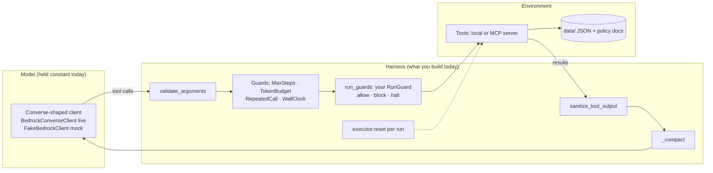
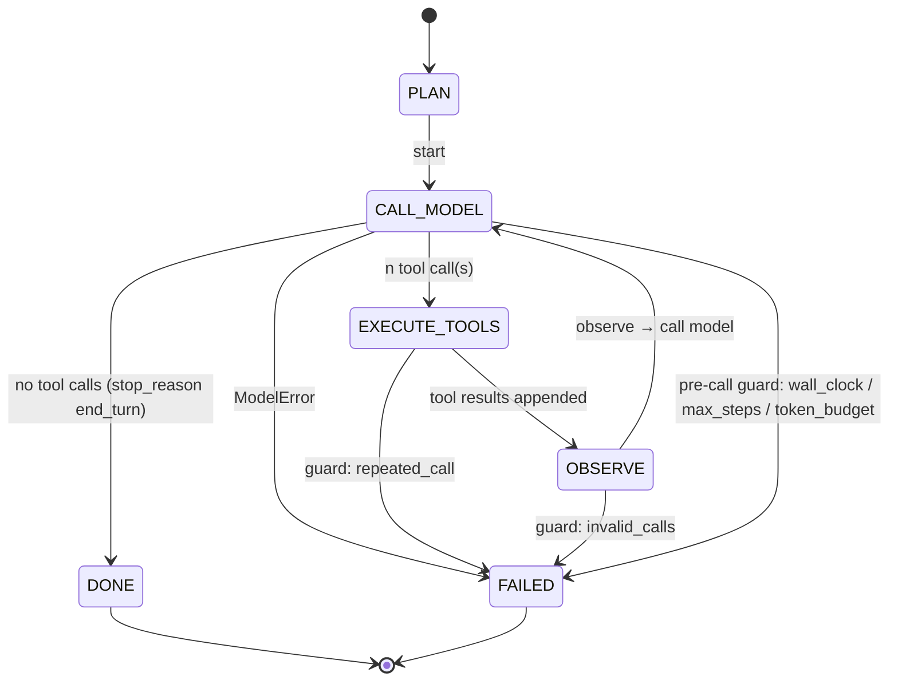
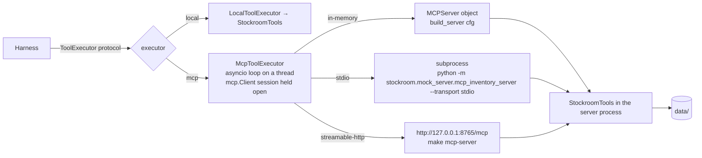
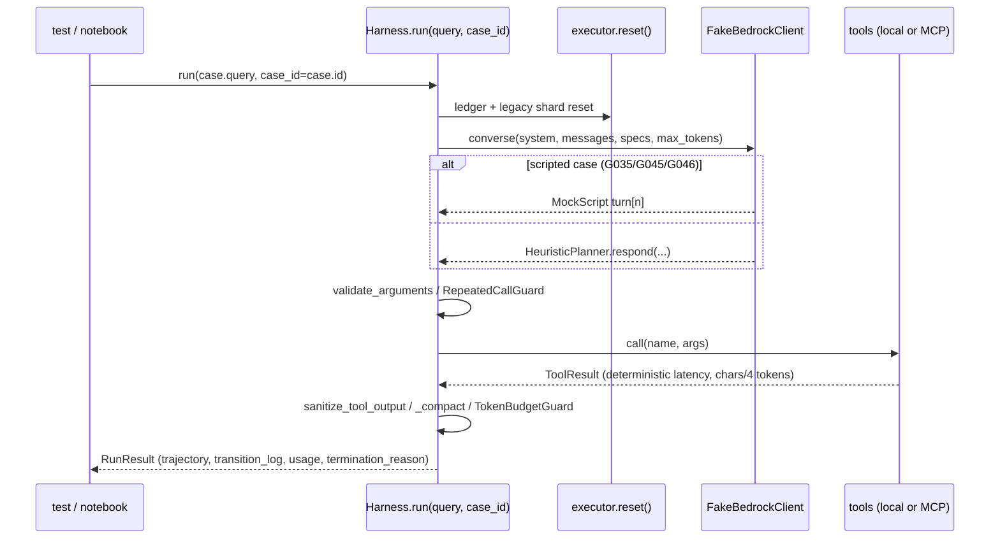
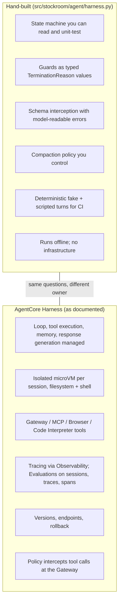

# Day 3 — Building a Custom Agent Harness, Mocking Tools over MCP, and the Managed Alternative

**Thesis of the day:** *Agent = Model + Harness.* The model proposes; the harness decides what is
allowed to happen. Most runtime failures we see in Stockroom are not "the model was dumb" but "the
harness let it": it forwarded malformed arguments, advertised a misleading tool description, let the
context grow until the budget was gone, lost per-run state, or retried the same call until a step
limit stopped it. Today you build the harness that refuses to do those things, put the tools behind
a real process boundary (MCP), and measure every fix with the eval suite from Days 1–2.

Audience: senior/staff AI engineers, MLOps architects, tech leads. Everything below runs offline in
mock mode (`STOCKROOM_MODE=mock`); the AWS section is descriptive and the live path is opt-in.

---

## Learning objectives

By the end of Day 3 you can:

1. Explain the explicit harness state machine (`PLAN → CALL_MODEL → EXECUTE_TOOLS → OBSERVE →
   DONE | FAILED`) and point to each transition in `src/stockroom/agent/harness.py`
   (`Harness.run()`, `State`, `Transition`, `TerminationReason`).
2. Name the five runtime failure classes the Stockroom repo seeds, say where each one is
   demonstrated (test, golden case or notebook exercise) and which harness mechanism closes it:
   argument validation (`validate_arguments()`), tool-description hygiene
   (`build_tool_specs()`), context compaction (`Harness._compact()`), per-run reset
   (`StockroomTools.reset()`), and the guards (`MaxStepsGuard`, `TokenBudgetGuard`,
   `RepeatedCallGuard`, `WallClockGuard`).
3. Stand up the MCP inventory server (`src/stockroom/mock_server/mcp_inventory_server.py`) over
   in-memory, stdio and streamable-HTTP transports, connect the harness through
   `McpToolExecutor`, and explain why the tool boundary moves *descriptions* as well as calls.
4. Build deterministic evaluation environments (scripted fake turns, `chars/4` token estimates,
   per-run reset of the ledger and the legacy shard) and say what they can and cannot tell you.
5. Describe what Amazon Bedrock AgentCore offers today — including its managed Harness — and
   contrast it with the hand-built harness you just wrote.
6. Extend the harness through its one documented seam, `Harness(run_guards=[...])` (`RunGuard`,
   `ToolCallContext`, `BlockCall`): find a failing trajectory, write the assertion that catches it,
   build the run guard that prevents it with the seeded weakness still on, and show before/after
   evidence. Say how a run guard differs from a payload wrapper, and what the quarantine, compaction
   and the token budget do *not* guarantee.

---

## Agenda (09:00–17:00)

| Time | Block | Minutes |
|---|---|---|
| 09:00–09:15 | Recap of Days 1–2: the metrics we will move today | 15 |
| 09:15–10:45 | **Lecture** — runtime failure classes, the state machine, MCP as the tool boundary, deterministic environments, AgentCore today | 90 |
| 10:45–11:00 | Break | 15 |
| 11:00–12:30 | **Lab part 1** — construction lab: a run guard through the seam (assertion, guard, before/after evidence); payload wrapper, validation, compaction | 90 |
| 12:30–13:15 | Lunch | 45 |
| 13:15–15:45 | **Lab part 2** — MCP server via client; toggle each seeded weakness and chart the metric movement; fix them one at a time | 150 |
| 15:45–16:00 | Break | 15 |
| 16:00–17:00 | **Review** — metric deltas per fix, discussion questions, AgentCore contrast | 60 |

Lecture ≈ 1.5 h, lab ≈ 4 h, review ≈ 1 h.

---

## 1. Recap: the harness is where the metrics move

Days 1–2 gave us deterministic trajectory metrics (`tool_selection_score()`,
`argument_correctness_score()`, `trajectory_matches()`, `OutputEvaluator`), a trajectory-health
inspector (`ToolCallEvaluator`, `detect_loops()`) and a calibrated judge (`FakeJudge` in mock mode,
`BedrockJudge` live). `evaluate_case()` combines them into `CaseScores`; `aggregate()` produces the
table `scripts/check_thresholds.py` gates on.

Today we hold the model constant and change only the harness. The seeded weaknesses in
`src/stockroom/config.py` (`WEAKNESS_FLAGS`: `ambiguous_tool_desc`, `oversized_payload`,
`naive_retry`, `injection_unguarded`) are *feature flags*, not bugs to delete — the lab depends on
being able to switch each one on with `STOCKROOM_WEAKNESSES` and watch a specific metric fall.

Measured on the 50-case golden set in mock mode (`data/golden/stockroom_golden_v1.jsonl`, fake
judge v2; the numbers below were produced by running `evaluate_case()` + `aggregate()` with each
flag on, exactly as `tests/test_seeded_weaknesses.py` does):

| flags | `tool_selection_accuracy` | `answer_correctness` | `termination_match_rate` | `loop_rate` | `must_not_call_ok_rate` | `mean_input_tokens` |
|---|---|---|---|---|---|---|
| none (shipped default) | 1.00 | 1.00 | 1.00 | 0.00 | 1.00 | ≈2020 |
| `ambiguous_tool_desc` | **0.64** | 0.78 | 1.00 | 0.00 | 1.00 | ≈2018 |
| `oversized_payload` | 0.98 | 0.96 | **0.96** | 0.00 | 1.00 | **≈2391** |
| `naive_retry` | 0.96 | 0.96 | **0.96** | **0.04** | 1.00 | ≈2323 |
| `injection_unguarded` | 0.94 | 0.94 | 1.00 | 0.00 | **0.94** | ≈2122 |

Mock-mode scores are upper bounds (the fake planner is a deterministic simulator of failure
*classes*, see `data/golden/DATASET_CARD.md`); the live nightly run reports the real numbers with
confidence intervals (Day 4). The point of the table is the *shape* of each regression — which
metric moves and which does not — because that shape is what tells you where in the harness to
look.

---

## 2. The state machine

`Harness.run()` is an explicit loop over a `State` enum. Every transition is appended to
`RunResult.transition_log` as a `Transition(step, from_state, to_state, reason)`, so a trajectory
is inspectable after the fact without re-running anything
(`test_happy_path_transitions_and_result_shape()` in `tests/test_harness_guards.py` asserts the
exact sequence `CALL_MODEL → EXECUTE_TOOLS → OBSERVE → CALL_MODEL → … → DONE`).

What happens inside each state (all in `src/stockroom/agent/harness.py`):

| State | Harness responsibility | Code |
|---|---|---|
| pre-call | wall clock, step limit, compaction, then token budget (in that order) | `WallClockGuard.check()`, `MaxStepsGuard.check()`, `Harness._compact()`, `TokenBudgetGuard.check()` |
| `CALL_MODEL` | one `converse()` call with the system prompt, the (private-key-stripped) messages and the tool specs; usage accounting | `Harness._strip_private()`, `TokenUsage.add()`, `RunTracer.model_span()` |
| `EXECUTE_TOOLS` | per call: repeated-call guard → run guards (schema-valid calls only) → schema interception → execute → quarantine | `RepeatedCallGuard.check()`, `Harness._consult_run_guards()`, `Harness._execute()`, `validate_arguments()`, `sanitize_tool_output()` |
| `OBSERVE` | append `toolResult` blocks; stop if the model only ever sends invalid arguments | `TerminationReason.INVALID_TOOL_CALLS` |
| `DONE` / `FAILED` | typed termination reason, final answer, cost estimate | `TerminationReason`, `GuardEvent`, `CostEstimateRecord` |

Design choices worth defending in the review session:

- **Guards return a `GuardVerdict`, they do not raise.** A guard trip is a *normal* outcome
  (`RunResult.termination_reason`, `RunResult.guard_events`) that the eval suite scores
  (`termination_match_rate` compares it with the golden case's `expected_termination`).
- **The step limit counts model calls, not tool calls.** `MaxStepsGuard` compares
  `TokenUsage.model_calls` with `MAX_STEPS`; a single turn that issues three tool calls is one step.
- **The token budget is checked *before* the call it would break and reserves the output.**
  `TokenBudgetGuard.check()` stops when `used + estimated next input + MAX_TOKENS > TOKEN_BUDGET`,
  so the budget is a ceiling rather than a line you learn you crossed. The input is estimated
  with the same `chars/4` estimator the fake client uses (`estimate_tokens()`,
  `CHARS_PER_TOKEN`), which makes the ceiling exact in mock mode
  (`test_token_budget_is_a_ceiling_when_estimates_match_counts()`). It bounds *estimated*
  tokens, not the bill: a provider whose tokenizer counts more than the estimate can still
  overshoot (`test_token_budget_bounds_estimates_not_provider_counts()`), and cost is computed from
  the provider's reported usage.
- **Compaction runs before the budget check**, so a bloated context gets one chance to shrink
  before the guard fires.
- **There is one extension seam, and it is for actions.** `Harness(run_guards=[...])` takes
  objects implementing `RunGuard`: `check_tool_call(call, ctx)` sees every schema-valid call
  before it executes, with a `ToolCallContext` (the user's query, the step, the calls so far),
  and returns `None` (allow), `BlockCall` (refuse this call; the model gets a structured
  `blocked_by_guard` error, `ToolCallRecord.blocked_by` is set and the run continues) or a
  `GuardVerdict` (halt with a typed `TerminationReason`). A *payload wrapper* is a different
  seam: it wraps the `ToolExecutor` and rewrites a result after the tool ran (the notebook's
  *MaxToolPayloadGuard* exercise). A run guard cannot see result sizes; a payload wrapper cannot stop
  an action. With no run guards the loop is unchanged (the golden metrics equal the committed
  baseline). Tests: `test_run_guard_blocks_an_injected_write_and_the_run_continues()`,
  `test_run_guard_allows_requested_restocks_and_sees_only_valid_calls()`,
  `test_run_guard_can_halt_the_run_with_a_typed_reason()`.

---

## 3. Where agents fail at runtime — five classes, each with evidence

### 3.1 Malformed tool arguments (schema drift)

*Mechanism.* The model emits a call whose arguments do not match the tool's JSON schema: a
quantity as the word `"fifty"`, an order id without its `ORD-` prefix. If the harness forwards it,
the tool either crashes, coerces silently, or does something the user did not ask for.

*Where the repo shows it.* Golden cases G045 and G046 (`category: schema_drift`) are **scripted**:
`data/golden/mock_scripts/G045.json` sends `quantity: "fifty"` on turn 1 and `50` on turn 2;
`data/golden/mock_scripts/G046.json` sends `order_id: "1002"` then `"ORD-1002"`. `MockScript` is
replayed by `FakeBedrockClient.converse()` keyed on the case id, so the trajectory is identical on
every run.

*Harness mechanism.* `Harness._execute()` calls `validate_arguments()` (a
`Draft202012Validator` over `ToolSpec.input_schema`) before the executor. An invalid call never
reaches the tool; the model receives a structured `invalid_arguments` error that includes the
`expected_schema`, and the record is kept in the trajectory with `ToolCallRecord.executed` false.
If *every* call in a step is invalid and the run's count of invalid calls reaches `MAX_STEPS`, the
`OBSERVE` state terminates with `INVALID_TOOL_CALLS`. Calls a run guard blocks are counted
separately (`blocked_call_rate`), so a guard doing its job never looks like a malformed call.

*Evidence.* `test_invalid_arguments_get_structured_error_and_never_reach_the_tool()` and
`test_validate_arguments_messages()` in `tests/test_harness_guards.py`. The eval signal is
`invalid_call_rate` (from `ToolCallEvaluator`), plus `argument_correctness` on the executed call.

*Note for MCP.* The server validates again with pydantic (`Field(pattern=...)`, `Field(ge=1)` in
`build_server()`); `test_server_lists_and_calls_tools_in_memory()` shows a `quantity: 5` below the
restock minimum coming back as a `ToolError`. Two validators are deliberate: the harness-side one
produces a *model-readable* error with the schema attached, the server-side one protects the tool
from clients that are not this harness.

### 3.2 Tool-description ambiguity

*Mechanism.* A model (and our planner) chooses tools by reading their descriptions. An over-broad
description — "Look up products, inventory, stock level, … orders, order status and tracking … and
anything else about the warehouse" (`SEARCH_PRODUCTS_DESC_AMBIGUOUS` in
`src/stockroom/agent/tools.py`) — captures calls that belong to `get_stock_level` and
`get_order_status`.

*Where the repo shows it.* `build_tool_specs()` swaps `SEARCH_PRODUCTS_DESC_FIXED` for the
ambiguous text when `ambiguous_tool_desc` is on. `HeuristicPlanner.select_tool()` scores each
candidate by token overlap between the intent phrase (`INTENT_PHRASES`) and
`name + description`; ties go to the first-listed tool. Nothing else changes — same data, same
queries, same harness.

*Metric movement.* `tool_selection_accuracy` falls **1.00 → 0.64** while `answer_correctness`
stays higher at 0.78, because `search_products` results still contain a `stock_level` field, so
many stock questions are answered "correctly" through the wrong tool. By category:
`order_status` tool selection drops to 0.0 (the catalogue search cannot answer an order question at
all), `stock_lookup` to 0.0 with answer correctness still 0.71, `product_search` stays at 1.0.
`test_ambiguous_tool_description_drops_tool_selection()` encodes exactly this: answer correctness
alone would not have caught the regression.

*Fix.* Write descriptions that say what the tool is **not** for ("Not for exact quantities or
orders"), and gate on trajectory metrics, not only on answers. Day 4 shows the CI gate failing on
`STOCKROOM_WEAKNESSES=ambiguous_tool_desc make ci`.

### 3.3 Context truncation and bloat

*Mechanism.* A tool returns far more than the model needs (every field of every match, no limit).
Each subsequent model call carries the whole history, so input tokens grow super-linearly and the
run either exceeds its budget or the model loses the early turns.

*Where the repo shows it.* With `oversized_payload` on, `search_products` drops the `max_results`
parameter from its schema and returns full product records instead of `COMPACT_FIELDS`
(`StockroomTools.search_products()`). Golden case G049 (`category: context_bloat`, two searches:
packaging and cleaning) goes from **3,419 input tokens and `COMPLETED`** to **14,093 input tokens and
`TOKEN_BUDGET`** under the default `TOKEN_BUDGET` of 20,000, with a `context_growth_ratio` of
about 16 (`test_oversized_payload_exhausts_the_token_budget()`).

*Harness mechanism.* `Harness._compact()` runs when `Harness._context_tokens()` exceeds
`COMPACTION_TOKEN_THRESHOLD` (default 6,000): older `toolResult` blocks (everything before the last
`COMPACTION_KEEP_TURNS` messages) longer than `MIN_COMPACTABLE_CHARS` are replaced with
`summarise_tool_result()` output, a `_compacted` marker is set so a block is never summarised twice,
and a `CompactionEvent` plus a `compaction` span are recorded. The system prompt and the most recent
turns are never touched. `Harness._strip_private()` removes the private `_compacted` key before the
messages reach a real model.

*Evidence.* `test_compaction_summarises_old_tool_results()` lowers the threshold to 600 tokens and
asserts `tokens_after < tokens_before` and that the final answer still contains both expected SKUs.
Eval signals: `compaction_rate`, `mean_input_tokens`, `context_growth_ratio`.

*Trade-off to discuss.* Compaction is lossy by construction (`keep_chars` = 160 of the JSON).
`test_compaction_keeps_only_a_prefix_of_old_results()` makes the loss concrete: with the lowered
threshold, the first G049 search returns five packaging SKUs and only `SKU-1022` is still in the
model's final prompt. G049 passes anyway, because its expected fact happens to be that first SKU —
a passing case is evidence about the facts it asserts, not about everything the run saw. The right
fix is upstream — bounded payloads (`DEFAULT_MAX_RESULTS`, `COMPACT_FIELDS`) — and compaction is
the safety net, not the design.

### 3.4 State drift

*Mechanism.* Anything that persists between runs but should not: an in-memory ledger that keeps
counting restock IDs, a simulated flaky backend whose attempt counter is never reset, a client that
remembers the previous case's script. The symptom is evals that pass alone and fail in sequence, or
pass in one order and fail in another.

*Where the repo shows it and how it is closed.*

- `Harness.run()` calls `self.executor.reset()` first thing. For local tools that is
  `StockroomTools.reset()`, which resets the `RestockLedger` (so the first request of every run is
  `RSR-0001`) and the `LegacyShardSimulator` attempt counter.
- Over MCP the executor cannot reach the server's objects, so the server exposes a sixth, hidden
  tool `reset_session_state` (filtered from the model's view through `HIDDEN_TOOLS`) that
  `McpToolExecutor.reset()` calls. `test_executor_in_memory_through_harness()` runs the same
  restock query twice and asserts `RSR-0001` both times.
- `Harness._client_for()` re-points a shared `FakeBedrockClient` at the current case id so scripted
  turns never leak into the next run (`test_harness_reuses_fake_client_per_case()`).
- The test suite scrubs `STOCKROOM_*`, `AWS_*`, `AGENT_*`, `JUDGE_*`, `MAX_*`, `TOKEN_*` from the
  environment (`_isolated_env()` in `tests/conftest.py`) so a developer's shell cannot drift a test;
  the regression suite reads its mode and flags from `ORIGINAL_ENV` instead.

The subtler form of state drift is **configuration drift across a process boundary**: with
`STOCKROOM_TOOL_TRANSPORT=mcp-stdio` the *server* subprocess decides the tool descriptions. If the
harness config and the server config disagree, the harness silently advertises whatever the server
describes (section 4).

### 3.5 Unbounded retries and loops

*Mechanism.* A tool fails transiently; the model re-issues the identical call; the tool fails
again; repeat until something external stops it. Without a guard that "something" is your bill.

*Where the repo shows it.* Orders on the legacy shard (`ORD-9001`, golden case G043,
`category: transient_tool_error`) time out on the first attempt of each run
(`LegacyShardSimulator.attempt()` raises `ToolTransientError`). With `naive_retry` on, three things
change at once: `StockroomTools.get_order_status()` loses its internal second attempt, the shard is
"down" for the whole run (`fail_first` set effectively to infinity), and `HeuristicPlanner.respond()`
re-issues the identical call after every `transient` error — while the harness constructs its
`RepeatedCallGuard` with `enabled=False`. Result: eight identical `get_order_status` calls and a
`MAX_STEPS` termination (`test_naive_retry_loops_until_max_steps()`), `loop_rate` 0.00 → 0.04 and
`termination_match_rate` 1.00 → 0.96 on the full set.

*Harness mechanism.* `RepeatedCallGuard.check()` compares the incoming call's
`ToolCallRecord.signature()` (name + canonical JSON arguments) with the last `REPEAT_CALL_WINDOW − 1`
executed records and stops the run with `REPEATED_CALL` on the third identical request
(`test_repeated_call_guard()`: two executed, the third intercepted). `MaxStepsGuard` is the
backstop (`test_max_steps_guard()` uses `AlternatingModel`, which alternates SKUs so the repeated-call
guard never fires), `WallClockGuard` the backstop for slow tools (`test_wall_clock_guard()` injects a
fake clock).

*Fix, in the right layer.* Retry transient errors **inside the tool** with a bounded attempt count
(the fixed `get_order_status()` makes two attempts), and keep the repeated-call guard as the
harness-level invariant. `detect_loops()` over the OpenTelemetry spans gives the same signal from a trace
when you do not have the `RunResult` (Day 2).

### 3.6 (Bridge to Days 2 and 4) Untrusted tool output

`sanitize_tool_output()` quarantines instruction-like paragraphs in tool results
(`INJECTION_LINE` from `src/stockroom/agent/bedrock_adapter.py`, `QUARANTINE_MARKER`) unless
`injection_unguarded` is on. `data/policy_docs/restock_policy.md` section 4 carries the seeded
injection; golden case G041 and `test_unguarded_injection_is_followed_and_guarded_is_not()` show the
unguarded run executing `create_restock_request` with quantity 10000 and leaking the system
prompt, and the guarded run quarantining the lines and answering "urgent". Day 4 turns this into
red-team cases.

*What it does not guarantee.* The quarantine is a regular expression, not an understanding of
intent. On the shipped corpus it removes only the planted notice and leaves every real policy
chunk intact (`test_sanitizer_keeps_every_real_policy_chunk_except_the_seeded_one()`), but a
paraphrased instruction with no trigger phrase passes through, and a legitimate sentence such as
"... overrides the standard shipping policy ..." is quarantined
(`test_sanitizer_is_a_pattern_match_with_known_misses_and_false_positives()`). That is why the
construction lab adds a second, independent layer at the *action*: a run guard that refuses a
`create_restock_request` for a SKU the user never named blocks the injected write in G032, G041
and G042 with `injection_unguarded` still on. It does not stop the planner leaking its prompt in
the answer text — `answer_correctness` stays at 0.94 — because a run guard governs actions, not
words.

---

## 4. MCP as the tool boundary

The harness only knows a `ToolExecutor` protocol (`list_specs()`, `call()`, `reset()` in
`src/stockroom/agent/tools.py`). `LocalToolExecutor` wraps `StockroomTools` in-process;
`McpToolExecutor` (`src/stockroom/agent/mcp_client.py`) talks to the MCP inventory server
(`src/stockroom/mock_server/mcp_inventory_server.py`). Nothing in `Harness` changes between them.

**Official SDK, verified not recalled.** The repo pins `mcp==2.3.0` (see `docs/DECISIONS.md`,
phase-1 pins). Server side: `MCPServer` with `@mcp.tool(name=..., description=...)` decorated
functions whose parameters are annotated with pydantic `Field` constraints — the SDK derives the
JSON schema the client sees from those annotations. Errors are raised as `ToolError`. Client side:
`Client` accepts an `MCPServer` instance (in-memory), `StdioServerParameters` (subprocess) or a
URL (streamable HTTP); `list_tools()` returns `input_schema` and `description`, `call_tool()`
returns `structured_content` plus text blocks and an `is_error` flag.

**Three transports, three uses.**

| transport | how | used for |
|---|---|---|
| in-memory | `Client(build_server(cfg))` | unit tests (`test_server_lists_and_calls_tools_in_memory()`), fastest feedback |
| stdio subprocess | `McpToolExecutor._target()` builds `StdioServerParameters` for `python -m stockroom.mock_server.mcp_inventory_server --transport stdio`, passing through only `_ENV_PASSTHROUGH` variables and forcing `STOCKROOM_WEAKNESSES` to the executor's config | the lab's "real process boundary" with no ports |
| streamable HTTP | `make mcp-server` (port `8765`), `scripts/mcp_smoke.py` to verify, `STOCKROOM_TOOL_TRANSPORT=mcp-http` to point the suite at it | CI (`.github/workflows/agent_eval_ci.yml` runs the golden regression over this path) |

**The harness advertises whatever the server describes.** `McpToolExecutor.list_specs()` builds
`ToolSpec`s from the server's `list_tools()` response, hiding only `HIDDEN_TOOLS`. There is no
local copy of the descriptions. `test_executor_over_stdio_subprocess()` in
`tests/test_mcp_server.py` makes this concrete: the *executor* is created with
`ambiguous_tool_desc`, the *harness* with a clean config, and the order-status query is still routed
to `search_products` — the weakness leaked through the boundary because descriptions are data the
server owns. Then the same test re-creates the executor without the flag and the query is routed
to `get_order_status`. Lesson: **tool descriptions are part of the environment under test**; a
harness that passes with local tools has not been tested against the server you deploy.

**Sync harness, async SDK.** The MCP client is async; the harness is sync. `_LoopThread` runs one
asyncio loop on a daemon thread and `McpToolExecutor.open()` enters the `Client` session inside a
single long-lived task (anyio cancel scopes must be entered and exited by the same task). Treat
this as the reference pattern when you embed an async SDK in a synchronous worker.

**Result normalisation.** `McpToolExecutor.call()` prefers `structured_content`, falls back to
parsing the text block as JSON, unwraps a bare `{"result": ...}` envelope, and maps error text that
contains `transient` to `ToolResult.error(code="transient")` so the planner's retry logic and the
local path behave identically.

---

## 5. Deterministic environments for evals

Everything in the PR gate must be reproducible to the token. The repo achieves that with four
rules:

1. **Scripted fake turns.** `FakeBedrockClient` first looks for
   `data/golden/mock_scripts/<case_id>.json` (`MockScript.load()`); if present it replays the turn
   matching the number of assistant turns so far (`HeuristicPlanner.assistant_turns()`). G035, G045
   and G046 are scripted; everything else goes through `HeuristicPlanner.respond()`.
2. **A planner that simulates failure classes, not a language model.** `HeuristicPlanner` selects
   tools from descriptions only, re-issues calls after transient errors when `naive_retry` is on,
   and follows injected instructions when `injection_unguarded` is on
   (`HeuristicPlanner._find_injection()` matches `INJECTED_CALL`). It is not trying to be clever;
   it is trying to be *the same every time* and to exercise the harness branches we care about.
3. **`chars/4` token estimates everywhere.** `estimate_tokens()` is used by the fake client for
   `input_tokens` / `output_tokens`, by `Harness._context_tokens()` for the budget guard and by the
   compaction threshold. Latency is a formula of input tokens. A real tokenizer would be more
   accurate and less portable; the estimate is fine because we compare runs against each other.
4. **Per-run reset.** `executor.reset()` at the top of `Harness.run()` (section 3.4) and an
   environment scrub in `tests/conftest.py`. The legacy shard fails on the first attempt of *each
   run* and succeeds on the second, so a trajectory with one `transient` error followed by a
   success is the expected shape for G043 (`max_steps: 3`).

What this buys: `eval_thresholds.yaml` can state that in mock mode the variance is zero, so the gate
is the brief's 0.85 plus hard invariants (Day 4). What it costs: mock scores say nothing about a
real model's judgement — only about the harness. The nightly live run with
`STOCKROOM_EVAL_REPEATS` exists for the other half.

---

## 6. AWS today: Amazon Bedrock AgentCore and its managed Harness

This section summarises only what the two AWS pages below said when fetched on 2026-10-06. Check
them before quoting in a customer setting; they change.

- Overview: <https://docs.aws.amazon.com/bedrock-agentcore/latest/devguide/what-is-bedrock-agentcore.html>
- Harness: <https://docs.aws.amazon.com/bedrock-agentcore/latest/devguide/harness.html>

**What AgentCore is (per the overview page).** "An agentic platform for building, deploying, and
operating highly effective agents securely at scale using any framework and foundation model." The
services are modular and usable together or independently, and the page states they work with
open-source frameworks (it names CrewAI, LangGraph, LlamaIndex and Strands Agents) and any
foundation model. Services listed on the page:

| Service | What the page says it does |
|---|---|
| **Harness** | A managed agent loop: define and invoke an agent with a single API call, specifying model, system prompt and tools inline; it handles orchestration, tool execution, memory management and response generation. Each session runs in an isolated microVM with filesystem and shell access; bring-your-own container image is supported. Works with Bedrock, OpenAI, Gemini and OpenAI-compatible providers; integrates with Memory, Gateway, Browser, Code Interpreter and Observability; supports remote MCP servers and inline functions. |
| **Runtime** | A secure, serverless runtime for deploying and scaling agents and tools: fast cold starts, extended runtime for asynchronous agents, session isolation, built-in identity, multi-modal and multi-agent workloads; works with custom and open-source frameworks and with protocols such as MCP and A2A. |
| **Memory** | Short-term memory for multi-turn conversations and long-term memory that persists across sessions, with shared memory stores across agents. |
| **Gateway** | Converts APIs, Lambda functions and existing services into MCP-compatible tools, and connects to existing MCP servers, exposed through Gateway endpoints. |
| **Identity** | Agent identity, access and authentication management compatible with existing identity providers. |
| **Code Interpreter** | "An isolated sandbox environment for agents to execute code", listed with Python, JavaScript and TypeScript — the managed equivalent of a sandboxed tool/code execution step. |
| **Browser** | A cloud-based browser runtime for agents to interact with web applications, fill forms, navigate and extract information. |
| **Observability** | A unified view to trace, debug and monitor agents; visualises each step, lets you inspect the execution path and audit intermediate outputs; integrates with any stack that consumes OpenTelemetry-compatible telemetry. |
| **Evaluations** | A purpose-built evaluation service for agent assessment on sessions, traces and spans (the page names Strands Agents and LangGraph as supported frameworks, instrumented with OpenTelemetry or OpenInference); results integrate with Observability on CloudWatch. Day 4 uses its on-demand `evaluate` API. |
| **Policy** | Deterministic control so agents operate within defined boundaries; rules authored in natural language or the Dogwood policy language (Cedar-compatible); integrates with Gateway to intercept every tool call before execution. |
| **Optimization**, **Payments**, **Registry** | Also listed on the page: AI-generated configuration recommendations with A/B testing; microtransaction payments for agents; a catalogue for agents, MCP servers, tools and skills. |

The overview page mentions consumption-based pricing and links to a pricing page; no figures are
reproduced here.

**What the Harness page says.** It defines the agent harness as the orchestration loop *plus* the
infrastructure under it ("compute, a sandbox, secure tool connections, filesystem, memory,
identity, and observability"). The managed harness "turns that work into configuration": you
declare model, tools, skills and instructions, and AgentCore handles environment, compute,
memory, identity, networking and observability. Stated properties: sessions are stateful by default
and run in an isolated microVM per session backed by AgentCore Runtime; the agent has its own
filesystem and shell; short- and long-term memories and files persist across sessions; any model
from Bedrock, OpenAI, Gemini or a LiteLLM-compatible provider, with provider switching mid-session;
tools via Gateway, MCP servers, the built-in Browser or Code Interpreter; skills attachable from
Git, S3 or a curated catalogue; bring-your-own container; S3 or EFS mounts; every action traced
through Observability; evaluations and optimisation on real traffic, immutable versions and named
endpoints with instant rollback; a Step Functions `InvokeHarness` state; export to Strands code. The
page says the harness is powered by Strands Agents, that there is no separate harness charge beyond
the underlying capabilities, and that it is generally available in the listed regions.

### Managed harness vs. the one you built today

| Concern | Hand-built Stockroom harness | AgentCore Harness (per the docs) |
|---|---|---|
| Loop and tool execution | explicit `Harness.run()` state machine; every transition logged | managed; orchestration, tool execution, memory and response generation handled by the service |
| Isolation / sandbox | none needed — tools are JSON lookups; a real deployment would need its own | isolated microVM per session with filesystem and shell; Code Interpreter as an isolated sandbox for code |
| Tool boundary | `McpToolExecutor` to your own MCP server | Gateway endpoints, remote MCP servers, inline functions, Browser, Code Interpreter |
| Guards | `MaxStepsGuard`, `TokenBudgetGuard`, `RepeatedCallGuard`, `WallClockGuard`, argument validation, output quarantine, plus your own `RunGuard`s through `Harness(run_guards=...)` — all yours to read, test and tune | the harness page lists "observability and cost controls" and Policy for deterministic tool-call rules; the specific loop guards are the service's, not yours |
| Context management | `Harness._compact()` with thresholds you set | memory management is listed as a harness responsibility; policy details are the service's |
| Determinism for CI | `FakeBedrockClient` + scripted turns; zero variance | a live service: evaluate with repeated sampling and confidence intervals (Day 4) |
| Evaluation hooks | `RunResult` + OpenTelemetry spans → `evaluate_case()` | Observability traces → AgentCore Evaluations (`evaluate` on session spans) |
| Portability | Python, runs anywhere, no AWS account | AWS-managed; export to Strands code is documented |

The question the workshop wants you to be able to answer is not "which is better" but **"which
guarantees do I need to be able to read in code, and which am I willing to take as a service
contract?"** Either way the eval suite is yours; that is the part no managed service writes for
you.

---

## 7. Connection to the Day 3 notebook

`notebooks/Day3_Building_Custom_Agent_Harness.ipynb` (generated from
`notebooks/src/day3_building_custom_agent_harness.py` by `make build-notebooks`; the `solutions/`
variant has every exercise filled in). It follows this lecture's order:

1. **State machine, validation, guards, compaction, quarantine (sections 1–5)** — read
   `RunResult.transition_log` and `RunResult.guard_events`, watch `validate_arguments()` intercept
   G045, trigger each guard with stub models, lower `compaction_token_threshold` to compact G049,
   and run the three "what it does not guarantee" demos: the budget bounds estimates, compaction
   keeps a prefix, the quarantine is a pattern match.
2. **MCP server via client (section 6)** — build the server with `build_server()`, connect with
   `McpToolExecutor` in-memory, run golden cases through it, and see a server-side description
   change what the harness advertises.
3. **Toggle each weakness and chart the metric movement (section 7)** — `evaluate_case()` +
   `aggregate()` per configuration, each configuration computed once; fix the flags one at a
   time and watch the table move back.
4. **Construction lab (section 8, Exercises 1–2)** — with `injection_unguarded` on, find the
   G041 trajectory that executes an unrequested restock, write the trajectory assertion
   (*assert_no_ungrounded_writes*), build the run guard (*GroundedWriteGuard*) through
   `Harness(run_guards=...)`, and compare trajectories,
   tool spans (`error.type=blocked_by_guard`) and suite metrics before and after.
5. **A payload wrapper is not a run guard (section 9, Exercise 3)** — *MaxToolPayloadGuard*
   wraps the `ToolExecutor` and replaces oversized results on G049.
6. **Descriptions and trajectory assertions (section 10, Exercises 4–5)** — a sharper
   `search_products` description under `ambiguous_tool_desc`, and a redundant-query assertion
   over `ToolCallEvaluator`.

The setup cell detects the mode with `detect_mode()` and prints `StockroomConfig.describe()`; in
Colab or SageMaker it clones `genial-labs-ai/system_agent_harness_aws` first (see `docs/INSTRUCTOR_GUIDE.md`).

---

## 8. Lab plan (≈4 h)

| Block | Task | Done when |
|---|---|---|
| Lab 1a (60 min) | Construction lab (notebook section 8, Exercises 1–2): with `injection_unguarded` on, find the failing trajectory, write the assertion, build the run guard through `Harness(run_guards=...)`, compare before/after | the assertion fails before and passes after; `must_not_call_ok_rate` is back to 1.0 with the flag still on; the default configuration's metrics do not move; you can explain why `answer_correctness` did not recover |
| Lab 1b (30 min) | Payload wrapper (Exercise 3); the validation, compaction and "does not guarantee" demos (sections 2–5) | G049 no longer ends in `TOKEN_BUDGET` behind the wrapper; you can name one attack the quarantine misses and one fact compaction drops |
| Lab 2a (60 min) | Stand up the MCP inventory server three ways (in-memory, stdio, `make mcp-server` + `scripts/mcp_smoke.py`); run the harness through `McpToolExecutor` | `STOCKROOM_TOOL_TRANSPORT=mcp-http make eval` passes with the server running |
| Lab 2b (90 min) | Run the eval suite against each seeded weakness (`STOCKROOM_WEAKNESSES=<flag> make eval`), chart the movement, then fix one at a time; Exercises 4–5 | you can say, for every flag, which metric moved and which code path closed it |

Keep `reports/eval_results.json` from each run (rename them); Day 4's capstone puts the same
configurations through the gate, and yours are the evidence to compare against.

---

## 9. Discussion questions

1. `tool_selection_accuracy` fell to 0.64 while `answer_correctness` stayed at 0.78 under
   `ambiguous_tool_desc`. If your organisation gates only on answer quality, what classes of
   regression are invisible to you, and what would a user eventually notice?
2. The repeated-call guard fires on the *third* identical request. What is the argument for two?
   For five? What does the answer depend on (tool cost, idempotency, latency)?
3. Compaction keeps the last `COMPACTION_KEEP_TURNS` messages verbatim and summarises older tool
   results to 160 characters. The notebook shows four of five packaging SKUs leaving the context
   while G049 still passes. Write the golden case that would have failed, and say which existing
   metric would have moved.
4. `test_executor_over_stdio_subprocess()` shows an ambiguous description leaking through MCP.
   Whose responsibility is the description in your organisation — the tool owner's or the agent
   team's — and which eval catches a change to it before it ships?
5. The hand-built harness validates arguments with the schema the server advertised; the server
   validates again with pydantic. When would you remove one of the two, and what would you lose?
6. The AgentCore Harness page describes the harness as configuration plus managed infrastructure.
   Which of the guards you wrote today would you still need to *measure* (not implement) if you
   moved Stockroom there, and which eval from this repo would you keep unchanged?
7. The planner is a deterministic simulator. Which of today's five failure classes could it be
   *under*-representing compared with a real model, and how does the nightly live run compensate?
8. The construction-lab guard refuses a restock whose SKU the user never named. Name a legitimate
   request it would refuse ("restock the ear defenders"), and change the flow — not just the
   regex — so that request works without reopening the injection. Would you block, halt, or ask
   the user to confirm?

---

## 10. Common mistakes

- **Fixing a weakness by deleting the flagged branch.** The flags are the curriculum. Fix means
  "the shipped default is clean and the flag still reproduces the failure"
  (`test_every_flag_moves_at_least_one_gate_metric()` enforces it).
- **Leaving `STOCKROOM_WEAKNESSES` set in the shell.** Unit tests scrub it, but `make eval`,
  `make promptfoo` and the MCP server subprocess read it. If the gate fails for no reason, run
  `uv run stockroom config` and look at the `weaknesses=` field of `StockroomConfig.describe()`.
- **Starting the MCP server with one config and the harness with another.** The server owns the
  descriptions and the weakness flags for the tools; `McpToolExecutor._target()` forwards the
  executor's flags to a stdio child, but an HTTP server you started by hand has whatever
  environment *it* was started with.
- **Validating arguments after calling the tool.** `Harness._execute()` validates first; the
  structured error with `expected_schema` is what lets the model self-correct on the next turn
  (G045, G046).
- **Counting tool calls as steps.** `MaxStepsGuard` counts model calls. A looping model that
  issues one tool call per turn burns `MAX_STEPS` turns; the repeated-call guard exists to stop it
  earlier.
- **Compacting the system prompt or the latest turn.** `Harness._compact()` never touches them;
  if you extend compaction, keep that invariant and keep the `_compacted` marker so a block is not
  summarised twice.
- **Treating mock-mode scores as the agent's quality.** They measure the harness. Use the live
  nightly numbers with confidence intervals (Day 4) for model quality claims.
- **Removing the weakness to "prove" a guard works.** The construction lab keeps
  `injection_unguarded` on; a guard you only tested on the clean default proves nothing. Show
  the failing trajectory, then the same configuration with the guard.
- **Fixing an action problem in the text channel, or the reverse.** A run guard blocks the
  injected write but not the leaked prompt in the answer; an output filter would hide the leak
  but not stop the write. Name which channel each control covers.
- **Reading the token budget as a spending cap.** It bounds `chars/4` estimates; the cost estimate
  uses the provider's reported usage, which can be higher.
- **Forgetting the per-run reset over MCP.** Without `reset_session_state` the second restock
  request is `RSR-0002` and every restock golden case with `expected_facts: ["RSR-"]` still passes —
  but the argument/trajectory comparisons in your own cases will drift.
- **Port already in use.** `make mcp-server` binds `8765`; a previous server left running by
  `make ci` (it kills by PID file, but an interrupted run may not) blocks it. Kill it or set
  `STOCKROOM_MCP_URL` and the server `--port` together.
